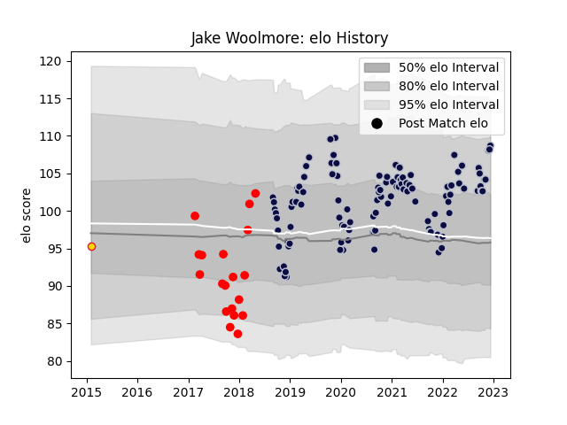

---  
layout: page  
title: Jake Woolmore  
date: 2023-03-17 17:15:45.349863  
categories: player  
---
# Jake Woolmore

## Positions: P

## Current elo: 99.0

## Current Percentile: 54.0

# Elo History

# Match History

| Team          |   Appearances |   Win Rate |
|:--------------|--------------:|-----------:|
| Bristol Rugby |           124 |   0.596774 |
| Jersey        |            31 |   0.66129  |
| Exeter Chiefs |             1 |   1        |

| Opponent               |   Matches |   Win Rate |
|:-----------------------|----------:|-----------:|
| Bath Rugby             |        10 |   0.8      |
| Sale Sharks            |        10 |   0.3      |
| Harlequins             |        10 |   0.6      |
| Exeter Chiefs          |         9 |   0.333333 |
| Wasps                  |         9 |   0.333333 |
| Northampton Saints     |         9 |   0.666667 |
| Leicester Tigers       |         9 |   0.611111 |
| Gloucester Rugby       |         9 |   0.666667 |
| Worcester Warriors     |         8 |   0.625    |
| Saracens               |         8 |   0.25     |
| Newcastle Falcons      |         6 |   0.833333 |
| London Irish           |         6 |   0.666667 |
| Zebre                  |         4 |   0.625    |
| Nottingham             |         4 |   0.625    |
| Ealing Trailfinders    |         3 |   0        |
| Stade Francais Paris   |         3 |   1        |
| Doncaster              |         3 |   0.333333 |
| London Scottish        |         3 |   1        |
| Cornish Pirates        |         3 |   1        |
| Rotherham Titans       |         3 |   1        |
| Richmond               |         3 |   0.666667 |
| Yorkshire Carnegie     |         2 |   0.5      |
| Bristol Rugby          |         2 |   0.5      |
| Brive                  |         2 |   1        |
| RC Enisei              |         2 |   1        |
| Perpignan              |         2 |   1        |
| Bedford                |         2 |   0.5      |
| La Rochelle            |         2 |   0.5      |
| Hartpury College       |         2 |   1        |
| Dragons                |         2 |   1        |
| Connacht               |         1 |   1        |
| Clermont Auvergne      |         1 |   0        |
| Scarlets               |         1 |   1        |
| Toulon                 |         1 |   1        |
| Bordeaux Begles        |         1 |   1        |
| Enisey-STM Krasnoyarsk |         1 |   1        |