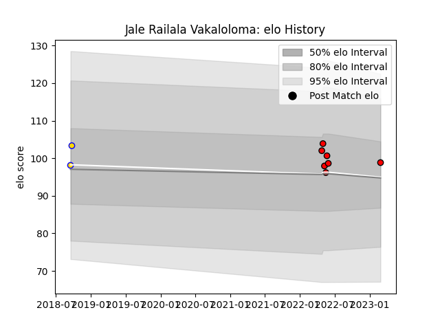

---  
layout: page  
title: Jale Railala Vakaloloma  
date: 2023-03-02 11:24:26.338442  
categories: player  
---
# Jale Railala Vakaloloma

## Positions: L

## Current elo: 99.0

## Current Percentile: 62.0

# Elo History

# Match History

| Team             |   Appearances |   Win Rate |
|:-----------------|--------------:|-----------:|
| San Diego Legion |             7 |   0.571429 |
| Brisbane City    |             2 |   1        |

| Opponent               |   Matches |   Win Rate |
|:-----------------------|----------:|-----------:|
| Austin Gilgronis       |         1 |          0 |
| Dallas Jackals         |         1 |          1 |
| Houston SaberCats      |         1 |          0 |
| L. A. Giltinis         |         1 |          1 |
| Melbourne Rising       |         1 |          1 |
| NOLA Gold              |         1 |          1 |
| New England Free Jacks |         1 |          1 |
| Rugby ATL              |         1 |          0 |
| Sydney Rays            |         1 |          1 |