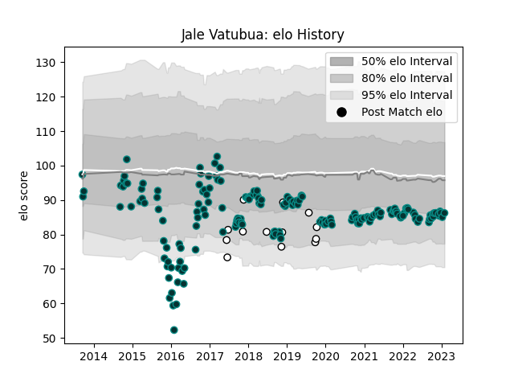

---  
layout: page  
title: Jale Vatubua  
date: 2023-02-02 18:51:28.880916  
categories: player  
---
# Jale Vatubua

## Positions: C

## Country: Fiji

## Current elo: 86.0

## Current Percentile: 22.0

# Elo History

# Match History

| Team   |   Appearances |   Win Rate |
|:-------|--------------:|-----------:|
| Pau    |           177 |   0.403955 |
| Fiji   |            13 |   0.384615 |

| Opponent             |   Matches |   Win Rate |
|:---------------------|----------:|-----------:|
| Castres Olympique    |        15 |   0.2      |
| Toulon               |        13 |   0.192308 |
| Stade Francais Paris |        13 |   0.461538 |
| Clermont Auvergne    |        12 |   0.25     |
| Racing 92            |        12 |   0.291667 |
| Montpellier Herault  |        12 |   0.5      |
| Bordeaux Begles      |        10 |   0.3      |
| Lyon                 |        10 |   0.25     |
| Agen                 |         9 |   0.777778 |
| Stade Toulousain     |         9 |   0.333333 |
| Brive                |         9 |   0.333333 |
| La Rochelle          |         8 |   0        |
| Bayonne              |         5 |   0.8      |
| Grenoble             |         5 |   0.8      |
| Perpignan            |         4 |   0.75     |
| Oyonnax              |         4 |   0.75     |
| Dragons              |         3 |   0.333333 |
| Narbonne             |         2 |   1        |
| Mont-de-Marsan       |         2 |   0.5      |
| Scotland             |         2 |   0.5      |
| Uruguay              |         2 |   0.5      |
| Italy                |         2 |   0.5      |
| Zebre                |         2 |   1        |
| Beziers              |         2 |   1        |
| Biarritz Olympique   |         2 |   1        |
| Albi                 |         1 |   1        |
| Calvisano            |         1 |   1        |
| Worcester Warriors   |         1 |   0        |
| Wales                |         1 |   0        |
| Australia            |         1 |   0        |
| Tonga                |         1 |   0        |
| Bourgoin-Jallieu     |         1 |   1        |
| Bristol Rugby        |         1 |   0        |
| Sale Sharks          |         1 |   0        |
| Carcassonne          |         1 |   0        |
| Gloucester Rugby     |         1 |   1        |
| Cardiff Blues        |         1 |   0        |
| New Zealand Maori    |         1 |   0        |
| Cheetahs             |         1 |   0        |
| Colomiers            |         1 |   0        |
| Montauban            |         1 |   1        |
| Edinburgh            |         1 |   0        |
| France               |         1 |   1        |
| London Irish         |         1 |   0        |
| Georgia              |         1 |   1        |
| Ireland              |         1 |   0        |