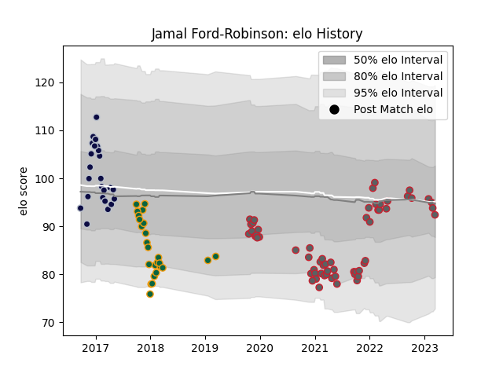

---  
layout: page  
title: Jamal Ford-Robinson  
date: 2023-03-17 17:03:50.751319  
categories: player  
---
# Jamal Ford-Robinson

## Positions: P

## Current elo: 92.0

## Current Percentile: None

# Elo History

# Match History

| Team               |   Appearances |   Win Rate |
|:-------------------|--------------:|-----------:|
| Gloucester Rugby   |            59 |   0.415254 |
| Northampton Saints |            25 |   0.32     |
| Bristol Rugby      |            24 |   0.25     |

| Opponent            |   Matches |   Win Rate |
|:--------------------|----------:|-----------:|
| Exeter Chiefs       |        10 |   0.1      |
| Sale Sharks         |        10 |   0.5      |
| Bath Rugby          |         9 |   0.444444 |
| Harlequins          |         9 |   0.333333 |
| Leicester Tigers    |         8 |   0        |
| Northampton Saints  |         7 |   0.285714 |
| Worcester Warriors  |         7 |   0.571429 |
| Newcastle Falcons   |         6 |   0.333333 |
| Wasps               |         6 |   0.833333 |
| London Irish        |         5 |   0.7      |
| Saracens            |         5 |   0        |
| Bristol Rugby       |         5 |   0.2      |
| Gloucester Rugby    |         4 |   0.25     |
| Ospreys             |         3 |   0        |
| Clermont Auvergne   |         2 |   0.5      |
| Pau                 |         2 |   1        |
| Lyon                |         2 |   0        |
| Connacht            |         2 |   0.5      |
| Dragons             |         1 |   1        |
| Perpignan           |         1 |   1        |
| Cardiff Blues       |         1 |   0        |
| Stade Toulousain    |         1 |   0        |
| Timisoara Saracens  |         1 |   1        |
| Montpellier Herault |         1 |   0        |