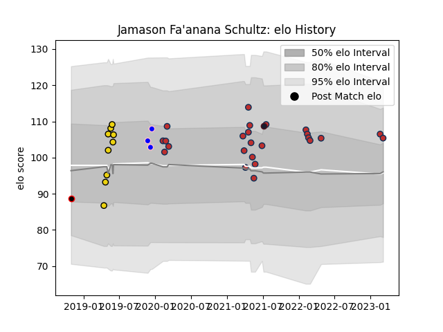

---  
layout: page  
title: Jamason Fa'anana Schultz  
date: 2023-03-21 18:25:06.852913  
categories: player  
---
# Jamason Fa'anana Schultz

Last updated: 2023-03-21
## Positions: N8, FL

## Country: United States of America

## Current elo: 105.0

## Current Percentile: 70.0

# Elo History

# Match History

| Team                            |   Appearances |   Win Rate |
|:--------------------------------|--------------:|-----------:|
| Old Glory DC                    |            26 |   0.480769 |
| Houston SaberCats               |             9 |   0.444444 |
| Kurita Water Gush               |             3 |   0.333333 |
| NTT Docomo Red Hurricanes Osaka |             1 |   1        |
| United States of America        |             1 |   0        |

| Opponent               |   Matches |   Win Rate |
|:-----------------------|----------:|-----------:|
| Toronto Arrows         |         4 |   0.25     |
| Rugby ATL              |         4 |   0.5      |
| NOLA Gold              |         3 |   0.5      |
| Seattle Seawolves      |         3 |   0.666667 |
| Rugby New York         |         3 |   0        |
| New England Free Jacks |         3 |   0.333333 |
| Utah Warriors          |         2 |   0.5      |
| R.U. New York          |         2 |   0        |
| Houston SaberCats      |         2 |   1        |
| Austin Gilgronis       |         2 |   0.5      |
| Shimizu Blue Sharks    |         1 |   1        |
| San Diego Legion       |         1 |   0        |
| Austin Elite Rugby     |         1 |   1        |
| Kamaishi Seawaves      |         1 |   0        |
| Glendale Raptors       |         1 |   1        |
| England                |         1 |   0        |
| Dallas Jackals         |         1 |   1        |
| Coca-Cola Red Sparks   |         1 |   0        |
| Chugoku Red Regulions  |         1 |   1        |
| Chicago Hounds         |         1 |   1        |
| Austin Herd            |         1 |   1        |
| L. A. Giltinis         |         1 |   0        |