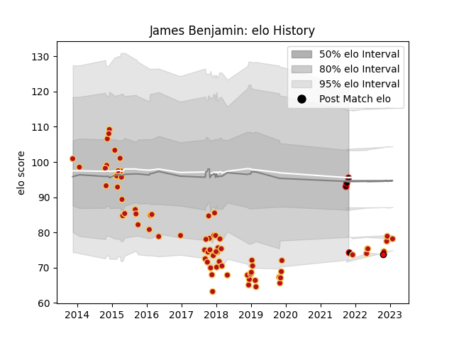

---  
layout: page  
title: James Benjamin  
date: 2023-01-30 11:46:52.137943  
categories: player  
---
# James Benjamin

## Positions: FL, N8

## Current elo: 96.0

## Current Percentile: None

# Elo History

# Match History

| Team             |   Appearances |   Win Rate |
|:-----------------|--------------:|-----------:|
| Dragons          |            75 |       0.36 |
| Cornish Pirates  |             4 |       0.75 |
| Hartpury College |             1 |       0    |

| Opponent            |   Matches |   Win Rate |
|:--------------------|----------:|-----------:|
| Leinster            |         7 |   0.428571 |
| Edinburgh           |         6 |   0.166667 |
| Glasgow Warriors    |         6 |   0.25     |
| Ospreys             |         5 |   0.4      |
| Scarlets            |         5 |   0.2      |
| Zebre               |         5 |   0.4      |
| Connacht            |         4 |   0.25     |
| Ulster              |         4 |   0.375    |
| Cardiff Blues       |         4 |   0.25     |
| RC Enisei           |         3 |   1        |
| Newcastle Falcons   |         3 |   0        |
| Clermont Auvergne   |         2 |   0        |
| Southern Kings      |         2 |   0.5      |
| Worcester Warriors  |         2 |   1        |
| Bordeaux Begles     |         2 |   0.5      |
| Benetton Treviso    |         2 |   0.5      |
| Munster             |         2 |   0        |
| Northampton Saints  |         2 |   0        |
| Timisoara Saracens  |         1 |   1        |
| Wasps               |         1 |   1        |
| Stormers            |         1 |   0        |
| Bedford             |         1 |   0        |
| Nottingham          |         1 |   1        |
| London Welsh        |         1 |   1        |
| Hartpury College    |         1 |   0        |
| Harlequins          |         1 |   0        |
| Exeter Chiefs       |         1 |   0        |
| Ealing Trailfinders |         1 |   1        |
| Coventry            |         1 |   1        |
| Castres Olympique   |         1 |   1        |
| Bucuresti           |         1 |   1        |
| Lions               |         1 |   0        |