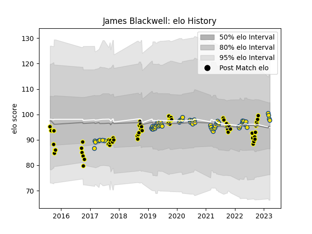

---  
layout: page  
title: James Blackwell  
date: 2023-03-17 17:09:40.503595  
categories: player  
---
# James Blackwell

## Positions: L

## Country: Hurricanes

## Current elo: 98.0

## Current Percentile: 59.0

# Elo History

# Match History

| Team       |   Appearances |   Win Rate |
|:-----------|--------------:|-----------:|
| Hurricanes |            65 |   0.6      |
| Wellington |            59 |   0.669492 |

| Opponent                 |   Matches |   Win Rate |
|:-------------------------|----------:|-----------:|
| Chiefs                   |        10 |   0.45     |
| Crusaders                |         9 |   0.111111 |
| Blues                    |         8 |   0.375    |
| Highlanders              |         7 |   0.857143 |
| Northland                |         7 |   0.857143 |
| Canterbury               |         6 |   0.666667 |
| Taranaki                 |         6 |   0.666667 |
| Hawke's Bay              |         6 |   0.583333 |
| Manawatu                 |         5 |   0.6      |
| Brumbies                 |         5 |   0.4      |
| Tasman                   |         5 |   0.2      |
| Bay of Plenty            |         5 |   0.8      |
| Melbourne Rebels         |         5 |   1        |
| New South Wales Waratahs |         4 |   1        |
| Waikato                  |         4 |   0.75     |
| Otago                    |         4 |   1        |
| Auckland                 |         4 |   0.5      |
| North Harbour            |         3 |   0.333333 |
| Queensland Reds          |         3 |   1        |
| Stormers                 |         3 |   0.666667 |
| Sunwolves                |         3 |   1        |
| Jaguares                 |         2 |   0.5      |
| Southland                |         2 |   1        |
| Counties Manukau         |         2 |   1        |
| Western Force            |         2 |   0.5      |
| Lions                    |         1 |   1        |
| Sharks                   |         1 |   1        |
| Bulls                    |         1 |   1        |
| British and Irish Lions  |         1 |   0.5      |