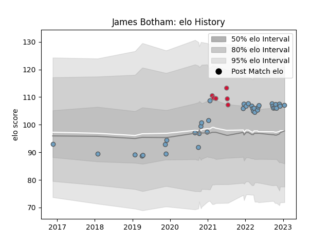

---  
layout: page  
title: James Botham  
date: 2023-01-17 11:42:36.289680  
categories: player  
---
# James Botham

## Positions: FL, N8

## Country: Wales

## Current elo: 107.0

## Current Percentile: 72.0

# Elo History

# Match History

| Team          |   Appearances |   Win Rate |
|:--------------|--------------:|-----------:|
| Cardiff Blues |            37 |   0.486486 |
| Wales         |             6 |   0.583333 |

| Opponent          |   Matches |   Win Rate |
|:------------------|----------:|-----------:|
| Munster           |         4 |   0.25     |
| Scarlets          |         3 |   0.666667 |
| Connacht          |         3 |   0.666667 |
| Dragons           |         3 |   1        |
| Argentina         |         2 |   0.25     |
| Glasgow Warriors  |         2 |   0.5      |
| Ulster            |         2 |   0        |
| Stormers          |         2 |   0.5      |
| Ospreys           |         2 |   0.5      |
| Lions             |         2 |   0        |
| Leicester Tigers  |         2 |   0        |
| Edinburgh         |         2 |   0        |
| Zebre             |         2 |   1        |
| Harlequins        |         1 |   0        |
| Benetton Treviso  |         1 |   1        |
| Leinster          |         1 |   1        |
| France            |         1 |   0        |
| England           |         1 |   1        |
| Newcastle Falcons |         1 |   1        |
| Canada            |         1 |   1        |
| Scotland          |         1 |   1        |
| Sharks            |         1 |   1        |
| Stade Toulousain  |         1 |   0        |
| Calvisano         |         1 |   1        |
| Bulls             |         1 |   0        |