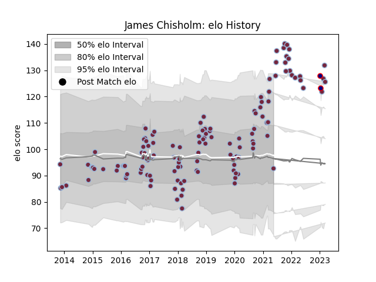

---  
layout: page  
title: James Chisholm  
date: 2023-02-02 18:51:09.647398  
categories: player  
---
# James Chisholm

## Positions: FL, N8

## Current elo: 92.0

## Current Percentile: 95.0

# Elo History

# Match History

| Team            |   Appearances |   Win Rate |
|:----------------|--------------:|-----------:|
| Harlequins      |           127 |   0.492126 |
| London Scottish |             2 |   0        |

| Opponent             |   Matches |   Win Rate |
|:---------------------|----------:|-----------:|
| Sale Sharks          |        11 |   0.454545 |
| Worcester Warriors   |        10 |   0.6      |
| Northampton Saints   |        10 |   0.5      |
| Leicester Tigers     |        10 |   0.35     |
| Bath Rugby           |        10 |   0.5      |
| Exeter Chiefs        |        10 |   0.5      |
| Newcastle Falcons    |        10 |   0.4      |
| Wasps                |        10 |   0.5      |
| Gloucester Rugby     |         8 |   0.75     |
| Bristol Rugby        |         8 |   0.5      |
| Saracens             |         7 |   0.285714 |
| London Irish         |         4 |   0.25     |
| Stade Francais Paris |         2 |   0.5      |
| Timisoara Saracens   |         2 |   1        |
| Benetton Treviso     |         2 |   0.5      |
| Edinburgh            |         2 |   0        |
| Scarlets             |         1 |   1        |
| Ulster               |         1 |   0        |
| Ospreys              |         1 |   1        |
| Agen                 |         1 |   1        |
| London Welsh         |         1 |   1        |
| Hartpury College     |         1 |   0        |
| Grenoble             |         1 |   0        |
| Dragons              |         1 |   1        |
| Clermont Auvergne    |         1 |   0        |
| Castres Olympique    |         1 |   1        |
| Cardiff Blues        |         1 |   1        |
| Bedford              |         1 |   0        |
| La Rochelle          |         1 |   0        |