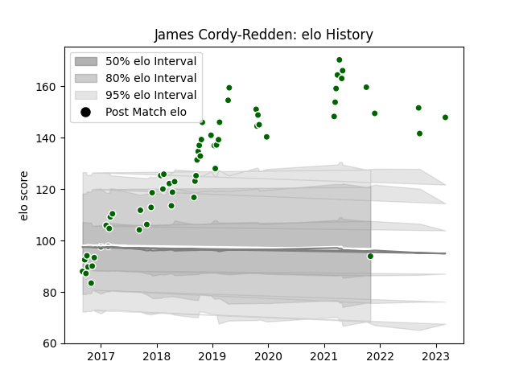

---  
layout: page  
title: James Cordy-Redden  
date: 2023-03-21 18:04:02.290133  
categories: player  
---
# James Cordy-Redden

Last updated: 2023-03-21
## Positions: W

## Current elo: 94.0

## Current Percentile: 99.0

# Elo History

# Match History

| Team                |   Appearances |   Win Rate |
|:--------------------|--------------:|-----------:|
| Ealing Trailfinders |            63 |   0.769841 |

| Opponent           |   Matches |   Win Rate |
|:-------------------|----------:|-----------:|
| Doncaster          |         8 |   0.75     |
| Bedford            |         6 |   0.833333 |
| Cornish Pirates    |         6 |   0.5      |
| Jersey             |         6 |   1        |
| Nottingham         |         6 |   0.666667 |
| Richmond           |         6 |   1        |
| London Scottish    |         5 |   1        |
| Hartpury College   |         4 |   1        |
| Coventry           |         3 |   0.833333 |
| Rotherham Titans   |         3 |   1        |
| Yorkshire Carnegie |         3 |   0.666667 |
| Ampthill           |         2 |   1        |
| London Irish       |         2 |   0        |
| Bristol Rugby      |         1 |   0        |
| Newcastle Falcons  |         1 |   0        |
| Saracens           |         1 |   0        |