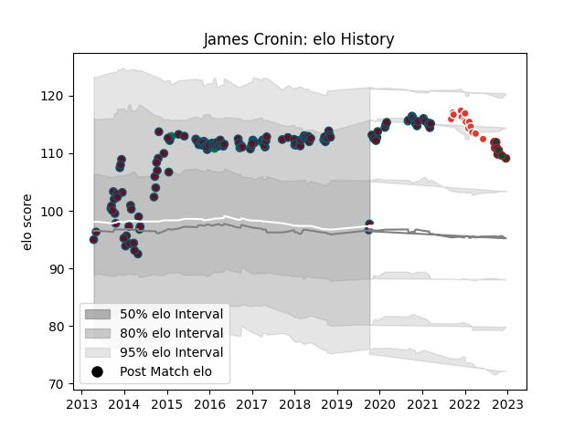

---  
layout: page  
title: James Cronin  
date: 2023-03-21 18:36:56.032711  
categories: player  
---
# James Cronin

Last updated: 2023-03-21
## Positions: P

## Country: Ireland

## Current elo: 98.0

## Current Percentile: 92.0

# Elo History

# Match History

| Team               |   Appearances |   Win Rate |
|:-------------------|--------------:|-----------:|
| Munster            |           139 |   0.68705  |
| Biarritz Olympique |            14 |   0.285714 |
| Leicester Tigers   |            11 |   0.545455 |
| Ireland            |             3 |   0.5      |

| Opponent             |   Matches |   Win Rate |
|:---------------------|----------:|-----------:|
| Leinster             |        14 |   0.214286 |
| Edinburgh            |        13 |   0.769231 |
| Glasgow Warriors     |        12 |   0.583333 |
| Zebre                |        11 |   1        |
| Connacht             |         9 |   0.777778 |
| Ospreys              |         9 |   0.888889 |
| Cardiff Blues        |         9 |   0.555556 |
| Scarlets             |         9 |   0.777778 |
| Dragons              |         8 |   0.875    |
| Ulster               |         7 |   0.642857 |
| Benetton Treviso     |         7 |   0.857143 |
| Saracens             |         6 |   0.333333 |
| Racing 92            |         6 |   0.583333 |
| Clermont Auvergne    |         4 |   0.5      |
| Gloucester Rugby     |         4 |   1        |
| Southern Kings       |         3 |   1        |
| Sale Sharks          |         3 |   0.666667 |
| Toulon               |         3 |   0.333333 |
| Perpignan            |         3 |   0.666667 |
| Leicester Tigers     |         3 |   0        |
| Exeter Chiefs        |         2 |   0.25     |
| La Rochelle          |         2 |   0.5      |
| Bordeaux Begles      |         2 |   0.5      |
| Harlequins           |         2 |   1        |
| Stade Toulousain     |         2 |   0.5      |
| Newcastle Falcons    |         2 |   0.5      |
| Stade Francais Paris |         2 |   0.5      |
| Castres Olympique    |         1 |   1        |
| Wales                |         1 |   0.5      |
| Brive                |         1 |   0        |
| Montpellier Herault  |         1 |   0        |
| Cheetahs             |         1 |   1        |
| France               |         1 |   0        |
| Italy                |         1 |   1        |
| Pau                  |         1 |   0        |
| Northampton Saints   |         1 |   1        |
| Bath Rugby           |         1 |   0        |