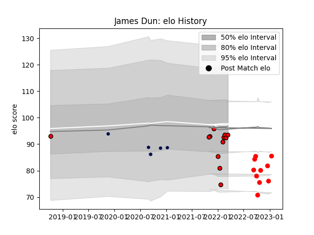

---  
layout: page  
title: James Dun  
date: 2023-01-21 15:41:21.856917  
categories: player  
---
# James Dun

## Positions: FL, L

## Current elo: 93.0

## Current Percentile: 7.0

# Elo History

# Match History

| Team             |   Appearances |   Win Rate |
|:-----------------|--------------:|-----------:|
| Hartpury College |            12 |   0.208333 |
| Jersey           |            10 |   0.85     |
| Bristol Rugby    |             5 |   0.4      |

| Opponent            |   Matches |   Win Rate |
|:--------------------|----------:|-----------:|
| Coventry            |         3 |       0.5  |
| Ealing Trailfinders |         3 |       0    |
| Ampthill            |         2 |       0.5  |
| Bedford             |         2 |       0.5  |
| Doncaster           |         2 |       0.5  |
| Jersey              |         2 |       0    |
| London Scottish     |         2 |       0.75 |
| Richmond            |         2 |       0.5  |
| Wasps               |         2 |       0    |
| Caldy               |         1 |       1    |
| Cornish Pirates     |         1 |       1    |
| Exeter Chiefs       |         1 |       1    |
| Hartpury College    |         1 |       1    |
| Nottingham          |         1 |       1    |
| Sale Sharks         |         1 |       0    |
| Zebre               |         1 |       1    |