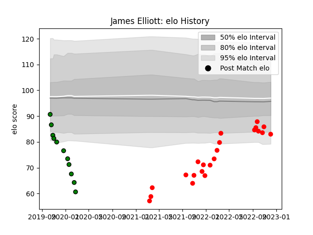

---  
layout: page  
title: James Elliott  
date: 2023-02-02 19:10:10.128138  
categories: player  
---
# James Elliott

## Positions: SH

## Current elo: 88.0

## Current Percentile: 0.0

# Elo History

# Match History

| Team               |   Appearances |   Win Rate |
|:-------------------|--------------:|-----------:|
| Jersey             |            39 |   0.692308 |
| Yorkshire Carnegie |            11 |   0        |

| Opponent            |   Matches |   Win Rate |
|:--------------------|----------:|-----------:|
| Coventry            |         7 |   0.5      |
| Ampthill            |         6 |   0.583333 |
| Cornish Pirates     |         5 |   0.6      |
| Hartpury College    |         5 |   0.8      |
| London Scottish     |         5 |   0.8      |
| Bedford             |         4 |   0.5      |
| Doncaster           |         4 |   0.25     |
| Ealing Trailfinders |         4 |   0        |
| Nottingham          |         4 |   0.75     |
| Richmond            |         4 |   0.75     |
| Newcastle Falcons   |         1 |   0        |
| Saracens            |         1 |   0        |