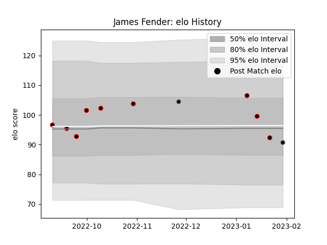

---  
layout: page  
title: James Fender  
date: 2023-02-02 19:04:46.547003  
categories: player  
---
# James Fender

## Positions: L

## Current elo: 91.0

## Current Percentile: 39.0

# Elo History

# Match History

| Team            |   Appearances |   Win Rate |
|:----------------|--------------:|-----------:|
| Cornish Pirates |             9 |   0.666667 |
| Ospreys         |             2 |   0.5      |

| Opponent        |   Matches |   Win Rate |
|:----------------|----------:|-----------:|
| Bedford         |         2 |          0 |
| Nottingham      |         2 |          1 |
| Ampthill        |         1 |          1 |
| Bulls           |         1 |          0 |
| Doncaster       |         1 |          1 |
| Jersey          |         1 |          0 |
| London Scottish |         1 |          1 |
| Richmond        |         1 |          1 |
| Zebre           |         1 |          1 |