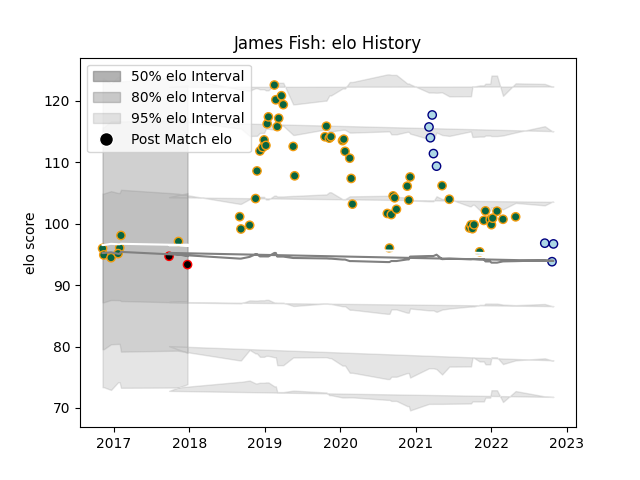

---  
layout: page  
title: James Fish  
date: 2023-03-21 18:54:32.659362  
categories: player  
---
# James Fish

Last updated: 2023-03-21
## Positions: H

## Current elo: 93.0

## Current Percentile: None

# Elo History

# Match History

| Team               |   Appearances |   Win Rate |
|:-------------------|--------------:|-----------:|
| Northampton Saints |            60 |   0.433333 |
| Bedford            |             8 |   0.375    |
| Cornish Pirates    |             2 |   0.5      |

| Opponent            |   Matches |   Win Rate |
|:--------------------|----------:|-----------:|
| Exeter Chiefs       |         9 |   0.222222 |
| Bath Rugby          |         5 |   0.4      |
| Bristol Rugby       |         5 |   0.2      |
| Saracens            |         5 |   0.2      |
| Sale Sharks         |         5 |   0.2      |
| Harlequins          |         4 |   0.5      |
| Wasps               |         4 |   0.25     |
| Gloucester Rugby    |         4 |   0.5      |
| Leicester Tigers    |         3 |   0.333333 |
| Worcester Warriors  |         3 |   1        |
| Hartpury College    |         2 |   1        |
| London Irish        |         2 |   0.5      |
| Clermont Auvergne   |         2 |   0        |
| Lyon                |         2 |   1        |
| Newcastle Falcons   |         2 |   1        |
| Dragons             |         2 |   1        |
| London Scottish     |         1 |   1        |
| Benetton Treviso    |         1 |   1        |
| Montpellier Herault |         1 |   0        |
| Jersey              |         1 |   0        |
| Richmond            |         1 |   0        |
| Rotherham Titans    |         1 |   1        |
| Coventry            |         1 |   0        |
| Cornish Pirates     |         1 |   0        |
| Scarlets            |         1 |   1        |
| Timisoara Saracens  |         1 |   1        |
| Leinster            |         1 |   0        |