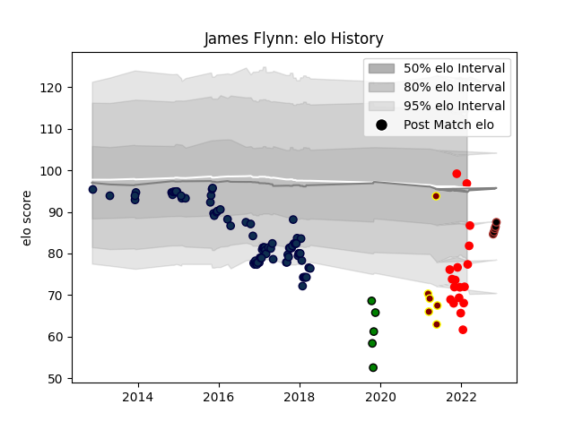

---  
layout: page  
title: James Flynn  
date: 2022-11-15 23:43:17.813983  
categories: player  
---
# James Flynn

## Positions: P

## Current elo: 84.0

## Current Percentile: 10.0

# Elo History

# Match History

| Team               |   Appearances |   Win Rate |
|:-------------------|--------------:|-----------:|
| Sale Sharks        |            79 |   0.436709 |
| Jersey             |            16 |   0.71875  |
| Ampthill           |             5 |   0.4      |
| Saracens           |             5 |   1        |
| Yorkshire Carnegie |             5 |   0        |

| Opponent            |   Matches |   Win Rate |
|:--------------------|----------:|-----------:|
| Saracens            |        11 |  0.0909091 |
| Northampton Saints  |         8 |  0.5       |
| Wasps               |         7 |  0.571429  |
| Bath Rugby          |         6 |  0.666667  |
| Harlequins          |         6 |  0.5       |
| Exeter Chiefs       |         5 |  0.4       |
| London Irish        |         4 |  0.75      |
| Newcastle Falcons   |         4 |  0.25      |
| Worcester Warriors  |         4 |  1         |
| Bedford             |         4 |  0.25      |
| Cardiff Blues       |         3 |  0.666667  |
| London Scottish     |         3 |  0.666667  |
| Scarlets            |         3 |  0.666667  |
| Bristol Rugby       |         3 |  0.333333  |
| Richmond            |         3 |  1         |
| Ampthill            |         3 |  0.5       |
| Leicester Tigers    |         3 |  0         |
| Doncaster           |         3 |  0         |
| Gloucester Rugby    |         3 |  0.333333  |
| Coventry            |         3 |  0.666667  |
| Cornish Pirates     |         2 |  0.5       |
| Stade Toulousain    |         2 |  0.25      |
| Hartpury College    |         2 |  0.5       |
| Pau                 |         2 |  1         |
| Oyonnax             |         2 |  0.5       |
| Nottingham          |         2 |  1         |
| Castres Olympique   |         2 |  1         |
| Lyon                |         2 |  0.5       |
| Sale Sharks         |         1 |  1         |
| Ealing Trailfinders |         1 |  0         |
| Munster             |         1 |  0         |
| Toulon              |         1 |  0         |
| Dragons             |         1 |  0         |