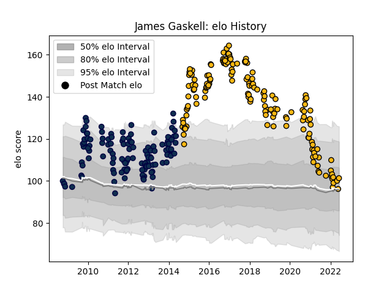

---  
layout: page  
title: James Gaskell  
date: 2023-03-21 18:36:35.210032  
categories: player  
---
# James Gaskell

Last updated: 2023-03-21
## Positions: L, FL

## Current elo: 101.0

## Current Percentile: 58.0

# Elo History

# Match History

| Team        |   Appearances |   Win Rate |
|:------------|--------------:|-----------:|
| Wasps       |           153 |   0.591503 |
| Sale Sharks |           125 |   0.428    |

| Opponent            |   Matches |   Win Rate |
|:--------------------|----------:|-----------:|
| Harlequins          |        27 |   0.444444 |
| Leicester Tigers    |        23 |   0.347826 |
| Gloucester Rugby    |        21 |   0.547619 |
| Bath Rugby          |        21 |   0.642857 |
| London Irish        |        19 |   0.552632 |
| Saracens            |        19 |   0.210526 |
| Northampton Saints  |        19 |   0.421053 |
| Exeter Chiefs       |        18 |   0.527778 |
| Newcastle Falcons   |        17 |   0.617647 |
| Worcester Warriors  |        17 |   0.764706 |
| Wasps               |         9 |   0.555556 |
| Sale Sharks         |         9 |   0.444444 |
| Bristol Rugby       |         8 |   0.75     |
| Leinster            |         6 |   0.416667 |
| Toulon              |         5 |   0.2      |
| Stade Toulousain    |         4 |   0.5      |
| Cardiff Blues       |         4 |   0.5      |
| Yorkshire Carnegie  |         3 |   1        |
| London Welsh        |         3 |   1        |
| Ulster              |         2 |   0.5      |
| Oyonnax             |         2 |   0.5      |
| Ospreys             |         2 |   0        |
| Agen                |         2 |   1        |
| Montpellier Herault |         2 |   0.5      |
| Leeds               |         2 |   1        |
| La Rochelle         |         2 |   0.5      |
| Connacht            |         2 |   0.5      |
| Castres Olympique   |         2 |   1        |
| Zebre               |         2 |   1        |
| Munster             |         1 |   0        |
| La Vila             |         1 |   1        |
| Dragons             |         1 |   0        |
| Clermont Auvergne   |         1 |   0        |
| Brive               |         1 |   0        |
| Biarritz Olympique  |         1 |   1        |