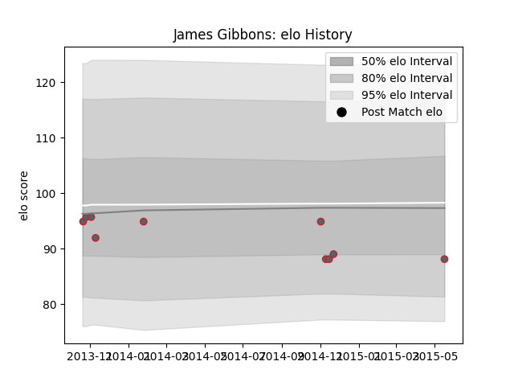

---  
layout: page  
title: James Gibbons  
date: 2023-01-13 11:36:27.582452  
categories: player  
---
# James Gibbons

## Positions: P

## Current elo: 87.0

## Current Percentile: 19.0

# Elo History

# Match History

| Team             |   Appearances |   Win Rate |
|:-----------------|--------------:|-----------:|
| Gloucester Rugby |            10 |        0.1 |

| Opponent           |   Matches |   Win Rate |
|:-------------------|----------:|-----------:|
| Bath Rugby         |         2 |          0 |
| Exeter Chiefs      |         1 |          0 |
| Harlequins         |         1 |          0 |
| London Welsh       |         1 |          1 |
| Munster            |         1 |          0 |
| Newcastle Falcons  |         1 |          0 |
| Northampton Saints |         1 |          0 |
| Scarlets           |         1 |          0 |
| Wasps              |         1 |          0 |