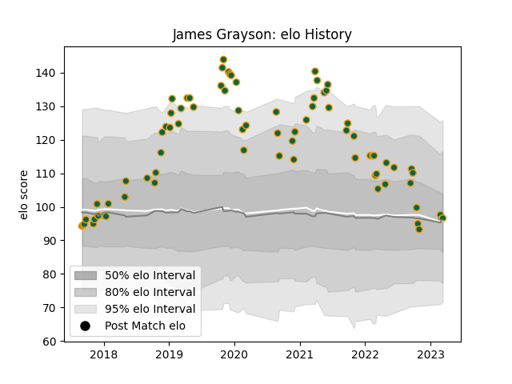

---  
layout: page  
title: James Grayson  
date: 2023-03-02 11:20:58.559733  
categories: player  
---
# James Grayson

## Positions: FH

## Current elo: 97.0

## Current Percentile: 46.0

# Elo History

# Match History

| Team               |   Appearances |   Win Rate |
|:-------------------|--------------:|-----------:|
| Northampton Saints |            74 |        0.5 |

| Opponent           |   Matches |   Win Rate |
|:-------------------|----------:|-----------:|
| Sale Sharks        |         8 |   0.25     |
| Bath Rugby         |         6 |   0.5      |
| Exeter Chiefs      |         6 |   0.166667 |
| Wasps              |         6 |   0.666667 |
| Leicester Tigers   |         6 |   0.333333 |
| Bristol Rugby      |         6 |   0.166667 |
| Gloucester Rugby   |         5 |   0.6      |
| Harlequins         |         5 |   0.6      |
| Worcester Warriors |         5 |   1        |
| London Irish       |         4 |   0.75     |
| Newcastle Falcons  |         4 |   0.5      |
| Dragons            |         3 |   1        |
| Clermont Auvergne  |         3 |   0.333333 |
| Leinster           |         2 |   0        |
| Saracens           |         2 |   0.5      |
| Timisoara Saracens |         2 |   1        |
| Benetton Treviso   |         1 |   1        |