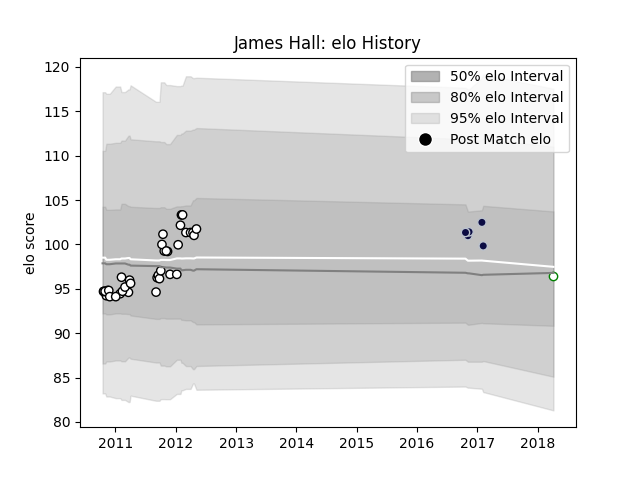

---  
layout: page  
title: James Hall  
date: 2022-12-18 16:29:25.346779  
categories: player  
---
# James Hall

## Positions: P

## Current elo: 96.0

## Current Percentile: None

# Elo History

# Match History

| Team              |   Appearances |   Win Rate |
|:------------------|--------------:|-----------:|
| Newcastle Falcons |            36 |   0.361111 |
| Bristol Rugby     |             5 |   0.2      |
| Nottingham        |             1 |   0        |

| Opponent            |   Matches |   Win Rate |
|:--------------------|----------:|-----------:|
| Bath Rugby          |         4 |   0        |
| Exeter Chiefs       |         4 |   0.25     |
| Gloucester Rugby    |         4 |   0.5      |
| Saracens            |         4 |   0        |
| Harlequins          |         3 |   0.166667 |
| Leicester Tigers    |         3 |   0        |
| London Irish        |         3 |   0        |
| Wasps               |         3 |   0.666667 |
| Sale Sharks         |         3 |   1        |
| Worcester Warriors  |         2 |   0.25     |
| Ospreys             |         2 |   0.5      |
| Petrarca Padova     |         1 |   1        |
| Montpellier Herault |         1 |   0        |
| Northampton Saints  |         1 |   0        |
| Bristol Rugby       |         1 |   0        |
| Lyon                |         1 |   1        |
| Cardiff Blues       |         1 |   1        |
| Yorkshire Carnegie  |         1 |   1        |