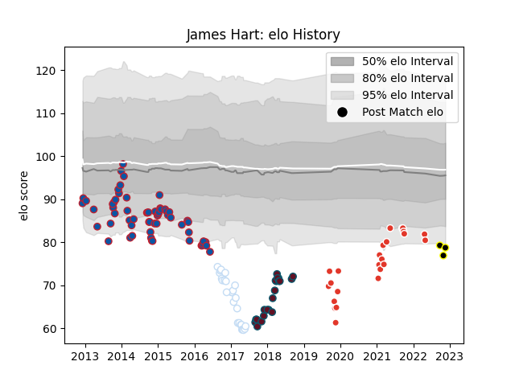

---  
layout: page  
title: James Hart  
date: 2022-11-22 11:45:52.767462  
categories: player  
---
# James Hart

## Positions: SH

## Current elo: 79.0

## Current Percentile: 3.0

# Elo History

# Match History

| Team               |   Appearances |   Win Rate |
|:-------------------|--------------:|-----------:|
| Grenoble           |            60 |   0.375    |
| Racing 92          |            27 |   0.481481 |
| Biarritz Olympique |            24 |   0.458333 |
| Munster            |            21 |   0.690476 |
| Mont-de-Marsan     |             3 |   0        |

| Opponent                   |   Matches |   Win Rate |
|:---------------------------|----------:|-----------:|
| Stade Toulousain           |         8 |   0.375    |
| Racing 92                  |         7 |   0.428571 |
| Oyonnax                    |         7 |   0.571429 |
| Castres Olympique          |         7 |   0.285714 |
| Bayonne                    |         7 |   0.642857 |
| Stade Francais Paris       |         6 |   0.5      |
| Brive                      |         6 |   0.5      |
| Toulon                     |         6 |   0.5      |
| Clermont Auvergne          |         6 |   0.166667 |
| Montpellier Herault        |         6 |   0.333333 |
| Perpignan                  |         4 |   0.25     |
| La Rochelle                |         4 |   0.25     |
| Grenoble                   |         3 |   0.666667 |
| Ospreys                    |         3 |   1        |
| Montauban                  |         3 |   0.333333 |
| Cheetahs                   |         3 |   1        |
| Edinburgh                  |         3 |   0.333333 |
| Bordeaux Begles            |         3 |   0.333333 |
| Cardiff Blues              |         3 |   0        |
| Glasgow Warriors           |         2 |   0.5      |
| Rouen                      |         2 |   1        |
| Biarritz Olympique         |         2 |   0        |
| Provence Rugby             |         2 |   0.5      |
| Pau                        |         2 |   0.5      |
| Carcassonne                |         2 |   0        |
| Munster                    |         2 |   0        |
| Colomiers                  |         2 |   1        |
| Ulster                     |         2 |   0.25     |
| Lyon                       |         2 |   0.5      |
| London Welsh               |         2 |   0.5      |
| London Irish               |         2 |   0        |
| Leicester Tigers           |         2 |   0.5      |
| Valence Romans Drome Rugby |         1 |   1        |
| Vannes                     |         1 |   1        |
| Soyaux-Angouleme           |         1 |   0        |
| Wasps                      |         1 |   0        |
| Arix Viadana               |         1 |   1        |
| Southern Kings             |         1 |   1        |
| Scarlets                   |         1 |   1        |
| Rovigo                     |         1 |   1        |
| Nevers                     |         1 |   0        |
| Massy                      |         1 |   0        |
| Harlequins                 |         1 |   0        |
| Dragons                    |         1 |   1        |
| Benetton Treviso           |         1 |   1        |
| Zebre                      |         1 |   1        |