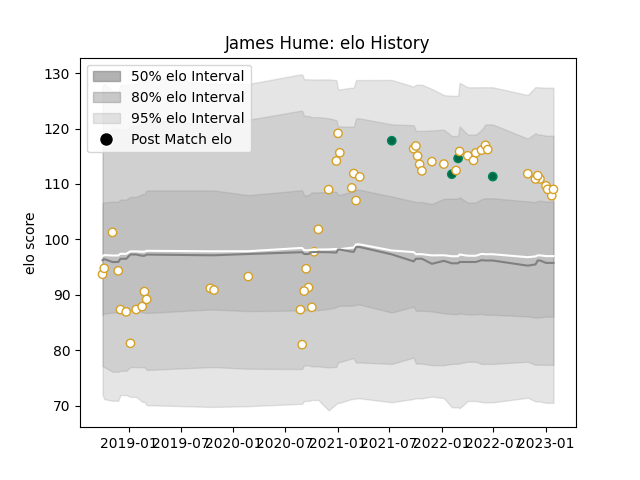

---  
layout: page  
title: James Hume  
date: 2022-12-14 11:18:43.824831  
categories: player  
---
# James Hume

## Positions: C

## Country: Ireland

## Current elo: 100.0

## Current Percentile: 66.0

# Elo History

# Match History

| Team    |   Appearances |   Win Rate |
|:--------|--------------:|-----------:|
| Ulster  |            48 |   0.635417 |
| Ireland |             4 |   0.75     |

| Opponent                 |   Matches |   Win Rate |
|:-------------------------|----------:|-----------:|
| Munster                  |         7 |   0.571429 |
| Leinster                 |         7 |   0.142857 |
| Connacht                 |         4 |   0.25     |
| Benetton Treviso         |         4 |   0.875    |
| Zebre                    |         4 |   1        |
| Cardiff Blues            |         3 |   1        |
| Dragons                  |         3 |   1        |
| Ospreys                  |         3 |   1        |
| Edinburgh                |         3 |   1        |
| Glasgow Warriors         |         2 |   1        |
| Italy                    |         1 |   1        |
| Lions                    |         1 |   1        |
| Bulls                    |         1 |   0        |
| New Zealand Maori        |         1 |   0        |
| Sale Sharks              |         1 |   0        |
| Scarlets                 |         1 |   0        |
| Sharks                   |         1 |   1        |
| Stade Toulousain         |         1 |   0        |
| Stormers                 |         1 |   0        |
| United States of America |         1 |   1        |
| Wales                    |         1 |   1        |
| Cheetahs                 |         1 |   1        |