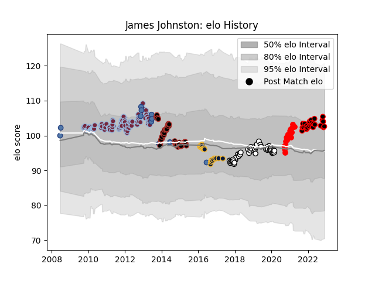

---  
layout: page  
title: James Johnston  
date: 2023-01-17 11:43:34.342180  
categories: player  
---
# James Johnston

## Positions: P

## Country: Samoa

## Current elo: 98.0

## Current Percentile: 50.0

# Elo History

# Match History

| Team               |   Appearances |   Win Rate |
|:-------------------|--------------:|-----------:|
| Harlequins         |           106 |   0.660377 |
| Saracens           |            53 |   0.679245 |
| Brive              |            48 |   0.4375   |
| Nice               |            26 |   0.461538 |
| Worcester Warriors |            25 |   0.36     |
| Rouen              |            16 |   0.4375   |
| Samoa              |            11 |   0.590909 |

| Opponent                   |   Matches |   Win Rate |
|:---------------------------|----------:|-----------:|
| Sale Sharks                |        18 |   0.805556 |
| Leicester Tigers           |        14 |   0.428571 |
| Northampton Saints         |        14 |   0.428571 |
| London Irish               |        14 |   0.714286 |
| Newcastle Falcons          |        13 |   0.769231 |
| Bath Rugby                 |        12 |   0.583333 |
| Gloucester Rugby           |        12 |   0.625    |
| Exeter Chiefs              |        11 |   0.363636 |
| Saracens                   |        10 |   0.2      |
| Wasps                      |        10 |   0.65     |
| Connacht                   |         9 |   0.666667 |
| Worcester Warriors         |         8 |   0.875    |
| Oyonnax                    |         7 |   0.857143 |
| Harlequins                 |         6 |   0.833333 |
| Stade Toulousain           |         6 |   0.333333 |
| Stade Francais Paris       |         5 |   0.8      |
| Clermont Auvergne          |         5 |   0.4      |
| Valence Romans Drome Rugby |         5 |   0.2      |
| Soyaux-Angouleme           |         4 |   0.75     |
| Toulon                     |         4 |   0        |
| Munster                    |         4 |   0.5      |
| Dax                        |         4 |   0.25     |
| Massy                      |         4 |   0.5      |
| Bristol Rugby              |         4 |   0.25     |
| London Welsh               |         3 |   1        |
| Lyon                       |         3 |   0.333333 |
| Leeds                      |         3 |   1        |
| Vannes                     |         3 |   0.666667 |
| Yorkshire Carnegie         |         3 |   1        |
| Racing 92                  |         3 |   0.333333 |
| Zebre                      |         3 |   1        |
| Biarritz Olympique         |         3 |   0.666667 |
| Carcassonne                |         3 |   0        |
| Italy                      |         2 |   1        |
| Nevers                     |         2 |   1        |
| Bayonne                    |         2 |   0.25     |
| Beziers                    |         2 |   0.5      |
| Tarbes                     |         2 |   1        |
| Suresnes                   |         2 |   0.5      |
| Bordeaux Begles            |         2 |   0.75     |
| Pau                        |         2 |   0.5      |
| Castres Olympique          |         2 |   0.5      |
| Chambery                   |         2 |   0.5      |
| Agen                       |         2 |   0        |
| Colomiers                  |         2 |   0        |
| Mont-de-Marsan             |         2 |   0        |
| Albi                       |         2 |   1        |
| Narbonne                   |         1 |   0        |
| Blagnac                    |         1 |   0        |
| Aubenas                    |         1 |   1        |
| Aurillac                   |         1 |   1        |
| Australia A                |         1 |   0        |
| Wales                      |         1 |   1        |
| Ireland                    |         1 |   0        |
| Grenoble                   |         1 |   1        |
| Ulster                     |         1 |   1        |
| US Bressane                |         1 |   0        |
| Georgia                    |         1 |   0.5      |
| Tonga                      |         1 |   1        |
| France                     |         1 |   0        |
| Dijon                      |         1 |   1        |
| Cognac Saint Jean d'Angély |         1 |   1        |
| Bourgoin-Jallieu           |         1 |   0        |
| South Africa               |         1 |   0        |
| Scotland                   |         1 |   1        |
| Scarlets                   |         1 |   0.5      |
| Canada                     |         1 |   1        |
| La Rochelle                |         1 |   0        |
| Provence Rugby             |         1 |   1        |
| Perpignan                  |         1 |   0        |
| Montauban                  |         1 |   0        |
| Montpellier Herault        |         1 |   0        |
| Ospreys                    |         1 |   1        |
| Cardiff Blues              |         1 |   0        |