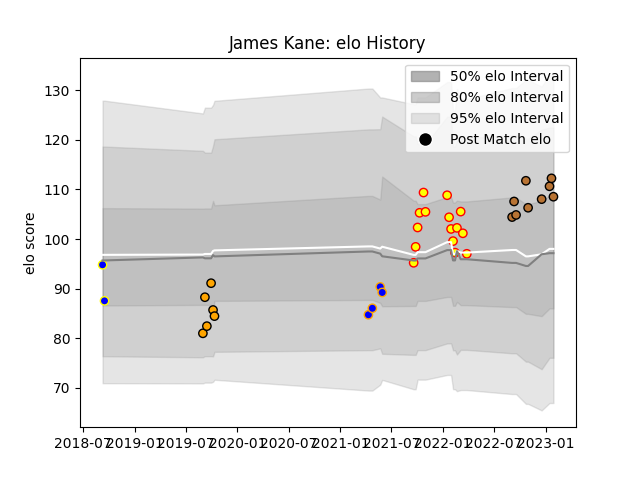

---  
layout: page  
title: James Kane  
date: 2023-02-02 18:50:25.686907  
categories: player  
---
# James Kane

## Positions: FB, W

## Current elo: 109.0

## Current Percentile: 77.0

# Elo History

# Match History

| Team               |   Appearances |   Win Rate |
|:-------------------|--------------:|-----------:|
| Richmond           |            15 |   0.5      |
| Narbonne           |             9 |   0.666667 |
| NSW Country Eagles |             6 |   0.583333 |
| Doncaster          |             4 |   0.75     |
| Sydney Rays        |             2 |   0        |

| Opponent            |   Matches |   Win Rate |
|:--------------------|----------:|-----------:|
| Nottingham          |         3 |   1        |
| Jersey              |         3 |   0.333333 |
| Nice                |         2 |   1        |
| Bedford             |         2 |   1        |
| Bourgoin-Jallieu    |         2 |   0.5      |
| Canberra Vikings    |         2 |   0        |
| Cornish Pirates     |         2 |   0.25     |
| Coventry            |         2 |   0        |
| Suresnes            |         2 |   1        |
| London Scottish     |         2 |   1        |
| Albi                |         1 |   0        |
| US Bressane         |         1 |   1        |
| Sydney Rays         |         1 |   1        |
| Richmond            |         1 |   1        |
| Queensland Country  |         1 |   0        |
| Hartpury College    |         1 |   1        |
| Melbourne Rising    |         1 |   1        |
| Ampthill            |         1 |   0        |
| Fijian Drua         |         1 |   0.5      |
| Ealing Trailfinders |         1 |   0        |
| Doncaster           |         1 |   0        |
| Chambery            |         1 |   0        |
| Brisbane City       |         1 |   0        |
| Western Force       |         1 |   1        |