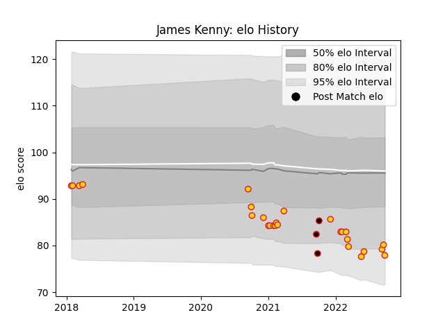

---  
layout: page  
title: James Kenny  
date: 2023-02-02 18:39:09.818436  
categories: player  
---
# James Kenny

## Positions: P

## Current elo: 85.0

## Current Percentile: 18.0

# Elo History

# Match History

| Team            |   Appearances |   Win Rate |
|:----------------|--------------:|-----------:|
| Exeter Chiefs   |            30 |   0.566667 |
| Cornish Pirates |             3 |   0.666667 |

| Opponent            |   Matches |   Win Rate |
|:--------------------|----------:|-----------:|
| Worcester Warriors  |         4 |   0.5      |
| Wasps               |         3 |   0        |
| Saracens            |         3 |   0.666667 |
| Northampton Saints  |         3 |   0.666667 |
| London Irish        |         3 |   0.333333 |
| Bristol Rugby       |         2 |   0        |
| Newcastle Falcons   |         2 |   1        |
| Leicester Tigers    |         2 |   1        |
| Harlequins          |         2 |   1        |
| Gloucester Rugby    |         2 |   0.5      |
| Hartpury College    |         1 |   0        |
| Ealing Trailfinders |         1 |   1        |
| Richmond            |         1 |   1        |
| Sale Sharks         |         1 |   1        |
| Castres Olympique   |         1 |   1        |
| Bulls               |         1 |   0        |
| Bath Rugby          |         1 |   1        |