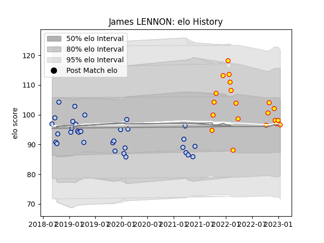

---  
layout: page  
title: James LENNON  
date: 2023-03-12 11:33:01.621460  
categories: player  
---
# James LENNON

## Positions: SH

## Current elo: 96.0

## Current Percentile: 58.0

# Elo History

# Match History

| Team     |   Appearances |   Win Rate |
|:---------|--------------:|-----------:|
| Bedford  |            32 |   0.4375   |
| Richmond |            23 |   0.391304 |

| Opponent            |   Matches |   Win Rate |
|:--------------------|----------:|-----------:|
| Ealing Trailfinders |         7 |   0.142857 |
| Coventry            |         6 |   0.333333 |
| Cornish Pirates     |         5 |   0.5      |
| Jersey              |         5 |   0.2      |
| London Scottish     |         5 |   0.8      |
| Ampthill            |         4 |   0.375    |
| Doncaster           |         4 |   0.25     |
| Hartpury College    |         4 |   0.75     |
| Nottingham          |         4 |   0.5      |
| Bedford             |         3 |   1        |
| London Irish        |         2 |   0        |
| Yorkshire Carnegie  |         2 |   0.5      |
| Caldy               |         1 |   0        |
| Newcastle Falcons   |         1 |   0        |
| Richmond            |         1 |   1        |
| Saracens            |         1 |   0        |