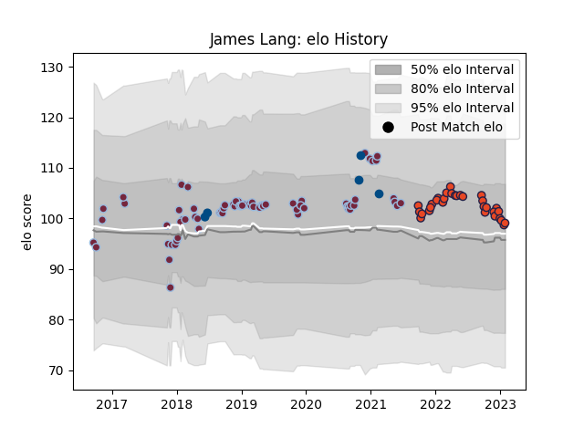

---  
layout: page  
title: James Lang  
date: 2022-12-14 11:24:55.444007  
categories: player  
---
# James Lang

## Positions: C, FH

## Country: Scotland

## Current elo: 109.0

## Current Percentile: 81.0

# Elo History

# Match History

| Team       |   Appearances |   Win Rate |
|:-----------|--------------:|-----------:|
| Harlequins |            74 |   0.493243 |
| Edinburgh  |            26 |   0.480769 |
| Scotland   |             5 |   0.8      |

| Opponent           |   Matches |   Win Rate |
|:-------------------|----------:|-----------:|
| Exeter Chiefs      |         8 |   0.25     |
| Bath Rugby         |         8 |   0.625    |
| Wasps              |         8 |   0.625    |
| Northampton Saints |         6 |   0.5      |
| Benetton Treviso   |         6 |   0.5      |
| Worcester Warriors |         6 |   0.333333 |
| Saracens           |         5 |   0.6      |
| Gloucester Rugby   |         5 |   0.6      |
| Leicester Tigers   |         5 |   0.4      |
| Bristol Rugby      |         4 |   0.5      |
| London Irish       |         4 |   0.375    |
| Ulster             |         4 |   0        |
| Stormers           |         3 |   0.166667 |
| Sale Sharks        |         3 |   0.666667 |
| Newcastle Falcons  |         3 |   0.666667 |
| Wales              |         2 |   0.5      |
| Dragons            |         2 |   1        |
| Clermont Auvergne  |         2 |   0        |
| Bulls              |         2 |   0.5      |
| Scarlets           |         2 |   1        |
| Lions              |         2 |   0        |
| Munster            |         2 |   0        |
| Ospreys            |         1 |   1        |
| Sharks             |         1 |   1        |
| Agen               |         1 |   1        |
| Leinster           |         1 |   0        |
| Argentina          |         1 |   1        |
| La Rochelle        |         1 |   0        |
| Grenoble           |         1 |   1        |
| Glasgow Warriors   |         1 |   1        |
| Georgia            |         1 |   1        |
| Connacht           |         1 |   1        |
| Cardiff Blues      |         1 |   1        |
| Canada             |         1 |   1        |
| Zebre              |         1 |   1        |