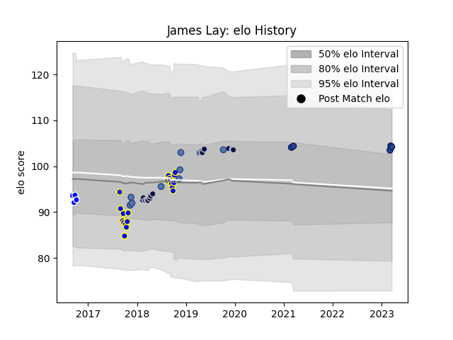

---  
layout: page  
title: James Lay  
date: 2023-03-21 18:25:02.783300  
categories: player  
---
# James Lay

Last updated: 2023-03-21
## Positions: P

## Country: Samoa

## Current elo: 104.0

## Current Percentile: 78.0

# Elo History

# Match History

| Team          |   Appearances |   Win Rate |
|:--------------|--------------:|-----------:|
| Bay of Plenty |            20 |   0.475    |
| Bristol Rugby |            17 |   0.735294 |
| Samoa         |             8 |   0.25     |
| Blues         |             5 |   0.6      |
| Auckland      |             4 |   0.5      |

| Opponent                 |   Matches |   Win Rate |
|:-------------------------|----------:|-----------:|
| Hawke's Bay              |         3 |   0.666667 |
| Counties Manukau         |         3 |   0.5      |
| Otago                    |         3 |   0.666667 |
| Southland                |         2 |   1        |
| Wellington               |         2 |   0        |
| Waikato                  |         2 |   0.5      |
| Taranaki                 |         2 |   0.5      |
| Hurricanes               |         2 |   1        |
| Saracens                 |         2 |   0.5      |
| Nottingham               |         1 |   1        |
| Romania                  |         1 |   0        |
| Rotherham Titans         |         1 |   1        |
| Sale Sharks              |         1 |   0.5      |
| Auckland                 |         1 |   0        |
| Scotland                 |         1 |   0        |
| North Harbour            |         1 |   0        |
| Spain                    |         1 |   1        |
| Stade Francais Paris     |         1 |   1        |
| Tasman                   |         1 |   0        |
| United States of America |         1 |   0        |
| Yorkshire Carnegie       |         1 |   1        |
| Northland                |         1 |   1        |
| Manawatu                 |         1 |   0        |
| Newcastle Falcons        |         1 |   1        |
| Georgia                  |         1 |   0        |
| Bay of Plenty            |         1 |   1        |
| Brumbies                 |         1 |   0        |
| Canterbury               |         1 |   0        |
| Crusaders                |         1 |   0        |
| Doncaster                |         1 |   1        |
| Ealing Trailfinders      |         1 |   1        |
| England                  |         1 |   0        |
| Germany                  |         1 |   1        |
| Bath Rugby               |         1 |   0        |
| Hartpury College         |         1 |   1        |
| Highlanders              |         1 |   1        |
| Japan                    |         1 |   0        |
| Jersey                   |         1 |   0        |
| La Rochelle              |         1 |   0        |
| Leicester Tigers         |         1 |   1        |
| London Scottish          |         1 |   1        |
| Zebre                    |         1 |   1        |