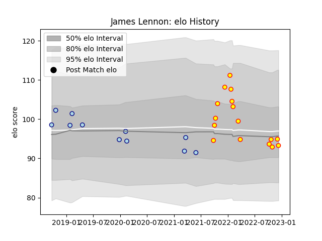

---  
layout: page  
title: James Lennon  
date: 2022-12-18 16:29:02.795155  
categories: player  
---
# James Lennon

## Positions: SH

## Current elo: 93.0

## Current Percentile: 45.0

# Elo History

# Match History

| Team     |   Appearances |   Win Rate |
|:---------|--------------:|-----------:|
| Richmond |            16 |   0.5      |
| Bedford  |            11 |   0.454545 |

| Opponent            |   Matches |   Win Rate |
|:--------------------|----------:|-----------:|
| Coventry            |         4 |        0.5 |
| Ealing Trailfinders |         4 |        0   |
| Ampthill            |         3 |        0.5 |
| Bedford             |         3 |        1   |
| Cornish Pirates     |         3 |        0.5 |
| Hartpury College    |         2 |        1   |
| Jersey              |         2 |        0   |
| London Irish        |         2 |        0   |
| London Scottish     |         2 |        1   |
| Nottingham          |         2 |        0.5 |