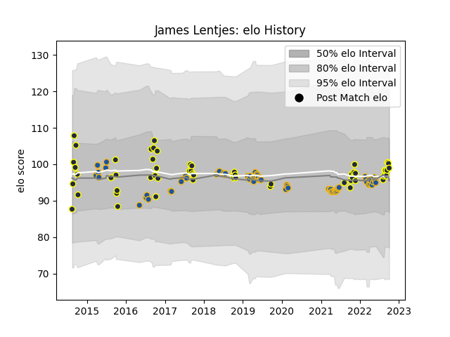

---  
layout: page  
title: James Lentjes  
date: 2023-03-17 17:12:05.297341  
categories: player  
---
# James Lentjes

## Positions: FL

## Country: Highlanders

## Current elo: 98.0

## Current Percentile: 62.0

# Elo History

# Match History

| Team        |   Appearances |   Win Rate |
|:------------|--------------:|-----------:|
| Highlanders |            66 |   0.469697 |
| Otago       |            56 |   0.5      |

| Opponent                 |   Matches |   Win Rate |
|:-------------------------|----------:|-----------:|
| Crusaders                |        12 |   0.166667 |
| Chiefs                   |         8 |   0.4375   |
| Hurricanes               |         7 |   0.142857 |
| North Harbour            |         6 |   0.666667 |
| Blues                    |         6 |   0.5      |
| Manawatu                 |         6 |   0.666667 |
| Canterbury               |         6 |   0.166667 |
| Bay of Plenty            |         5 |   0.6      |
| Southland                |         5 |   1        |
| Melbourne Rebels         |         5 |   0.4      |
| Waikato                  |         5 |   0.6      |
| New South Wales Waratahs |         5 |   0.6      |
| Tasman                   |         4 |   0.5      |
| Queensland Reds          |         4 |   1        |
| Brumbies                 |         4 |   0.5      |
| Wellington               |         4 |   0.25     |
| Taranaki                 |         3 |   0        |
| Northland                |         3 |   0.666667 |
| Auckland                 |         3 |   0.333333 |
| Lions                    |         3 |   0.333333 |
| Hawke's Bay              |         3 |   0.666667 |
| Counties Manukau         |         3 |   0        |
| Jaguares                 |         2 |   1        |
| Stormers                 |         2 |   0.5      |
| Bulls                    |         2 |   0.75     |
| Western Force            |         2 |   1        |
| Moana Pasifika           |         1 |   1        |
| Sharks                   |         1 |   0        |
| Sunwolves                |         1 |   1        |
| British and Irish Lions  |         1 |   1        |