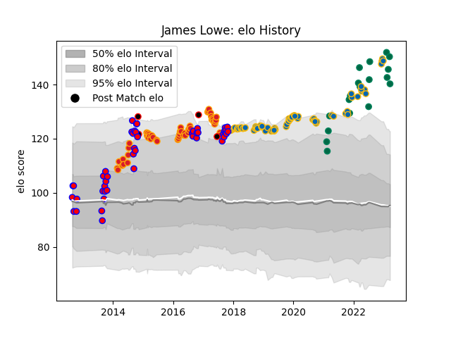

---  
layout: page  
title: James Lowe  
date: 2023-02-02 19:07:13.970756  
categories: player  
---
# James Lowe

## Positions: W

## Country: Ireland

## Current elo: 153.0

## Current Percentile: 99.0

# Elo History

# Match History

| Team              |   Appearances |   Win Rate |
|:------------------|--------------:|-----------:|
| Leinster          |            57 |   0.877193 |
| Chiefs            |            51 |   0.676471 |
| Tasman            |            43 |   0.744186 |
| Ireland           |            13 |   0.769231 |
| New Zealand Maori |             4 |   0.75     |

| Opponent                 |   Matches |   Win Rate |
|:-------------------------|----------:|-----------:|
| Munster                  |        10 |   0.9      |
| Taranaki                 |         7 |   0.571429 |
| Blues                    |         7 |   0.928571 |
| Highlanders              |         7 |   0.285714 |
| Crusaders                |         7 |   0.714286 |
| Canterbury               |         7 |   0.428571 |
| Scarlets                 |         6 |   0.75     |
| Southland                |         6 |   1        |
| Hurricanes               |         5 |   0.6      |
| Connacht                 |         5 |   0.8      |
| Stormers                 |         5 |   0.8      |
| Benetton Treviso         |         5 |   0.9      |
| New Zealand              |         4 |   0.75     |
| Brumbies                 |         4 |   0.5      |
| Waikato                  |         4 |   1        |
| North Harbour            |         4 |   0.375    |
| Glasgow Warriors         |         4 |   1        |
| Saracens                 |         3 |   0.333333 |
| Japan                    |         3 |   1        |
| Southern Kings           |         3 |   1        |
| Otago                    |         3 |   1        |
| Hawke's Bay              |         3 |   1        |
| Ospreys                  |         3 |   1        |
| New South Wales Waratahs |         2 |   0.5      |
| Northampton Saints       |         2 |   1        |
| Auckland                 |         2 |   0.75     |
| Queensland Reds          |         2 |   1        |
| Stade Toulousain         |         2 |   0.5      |
| Melbourne Rebels         |         2 |   0.5      |
| Lyon                     |         2 |   1        |
| Lions                    |         2 |   0.5      |
| Italy                    |         2 |   1        |
| Ulster                   |         2 |   1        |
| Dragons                  |         2 |   1        |
| Counties Manukau         |         2 |   0.5      |
| Bulls                    |         2 |   1        |
| Wellington               |         2 |   1        |
| Western Force            |         2 |   1        |
| Bath Rugby               |         2 |   1        |
| Scotland                 |         2 |   1        |
| Sunwolves                |         1 |   1        |
| United States of America |         1 |   1        |
| Wales                    |         1 |   0        |
| Wasps                    |         1 |   1        |
| Argentina                |         1 |   1        |
| Sharks                   |         1 |   0        |
| Racing 92                |         1 |   1        |
| Northland                |         1 |   1        |
| Montpellier Herault      |         1 |   1        |
| Manawatu                 |         1 |   1        |
| Jaguares                 |         1 |   1        |
| Gloucester Rugby         |         1 |   1        |
| France                   |         1 |   0        |
| England                  |         1 |   1        |
| Edinburgh                |         1 |   1        |
| Cheetahs                 |         1 |   1        |
| British and Irish Lions  |         1 |   0        |
| Bay of Plenty            |         1 |   1        |
| Zebre                    |         1 |   1        |