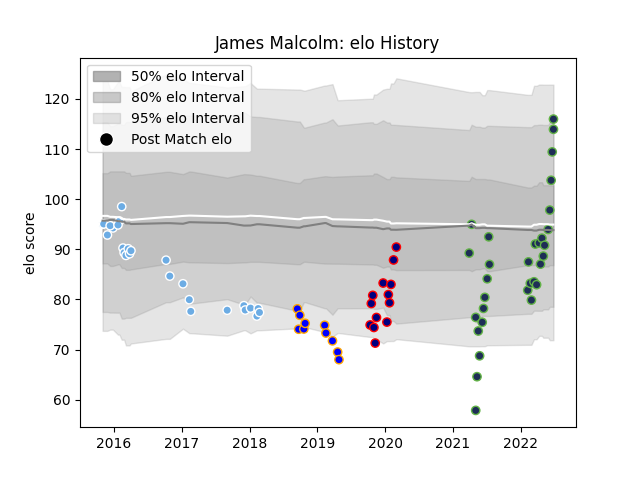

---  
layout: page  
title: James Malcolm  
date: 2023-03-17 17:34:10.829887  
categories: player  
---
# James Malcolm

## Positions: H

## Current elo: 116.0

## Current Percentile: 84.0

# Elo History

# Match History

| Team              |   Appearances |   Win Rate |
|:------------------|--------------:|-----------:|
| Seattle Seawolves |            31 |   0.483871 |
| Glasgow Warriors  |            26 |   0.730769 |
| London Scottish   |            13 |   0.346154 |
| Doncaster         |            10 |   0.2      |

| Opponent               |   Matches |   Win Rate |
|:-----------------------|----------:|-----------:|
| San Diego Legion       |         5 |   0.8      |
| Cardiff Blues          |         4 |   1        |
| Utah Warriors          |         4 |   0.75     |
| Houston SaberCats      |         4 |   0.75     |
| Austin Gilgronis       |         3 |   0        |
| Ealing Trailfinders    |         3 |   0        |
| L. A. Giltinis         |         3 |   0.333333 |
| Benetton Treviso       |         3 |   1        |
| Ulster                 |         3 |   0.333333 |
| Nottingham             |         3 |   0        |
| Munster                |         2 |   0.5      |
| New England Free Jacks |         2 |   0        |
| Ampthill               |         2 |   0.25     |
| Ospreys                |         2 |   0.75     |
| R.U. New York          |         2 |   0        |
| London Irish           |         2 |   0        |
| Scarlets               |         2 |   0.5      |
| Yorkshire Carnegie     |         2 |   1        |
| Rugby New York         |         2 |   0        |
| Zebre                  |         2 |   1        |
| Cornish Pirates        |         2 |   0.5      |
| Coventry               |         2 |   0        |
| Dragons                |         2 |   0.75     |
| Dallas Jackals         |         2 |   1        |
| Leinster               |         1 |   1        |
| Richmond               |         1 |   1        |
| Bedford                |         1 |   0        |
| Cheetahs               |         1 |   1        |
| Connacht               |         1 |   1        |
| Toronto Arrows         |         1 |   1        |
| Rugby ATL              |         1 |   0        |
| Racing 92              |         1 |   1        |
| Montpellier Herault    |         1 |   0        |
| Doncaster              |         1 |   0        |
| Old Glory DC           |         1 |   0        |
| Edinburgh              |         1 |   0        |
| Newcastle Falcons      |         1 |   0        |
| Hartpury College       |         1 |   0        |
| NOLA Gold              |         1 |   1        |
| Jersey                 |         1 |   1        |
| London Scottish        |         1 |   1        |