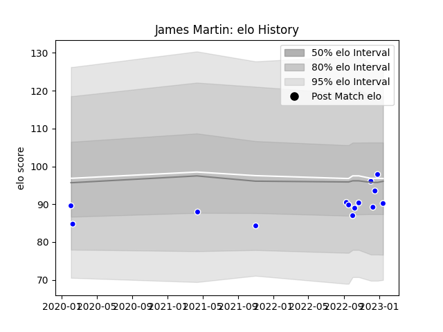

---  
layout: page  
title: James Martin  
date: 2023-01-21 15:43:22.706556  
categories: player  
---
# James Martin

## Positions: W

## Current elo: 90.0

## Current Percentile: 56.0

# Elo History

# Match History

| Team     |   Appearances |   Win Rate |
|:---------|--------------:|-----------:|
| Coventry |            14 |   0.607143 |

| Opponent            |   Matches |   Win Rate |
|:--------------------|----------:|-----------:|
| Cornish Pirates     |         3 |   0.666667 |
| Bedford             |         2 |   0.5      |
| Jersey              |         2 |   0.25     |
| Ampthill            |         1 |   1        |
| Doncaster           |         1 |   1        |
| Ealing Trailfinders |         1 |   0        |
| Hartpury College    |         1 |   0        |
| London Scottish     |         1 |   1        |
| Nottingham          |         1 |   1        |
| Richmond            |         1 |   1        |