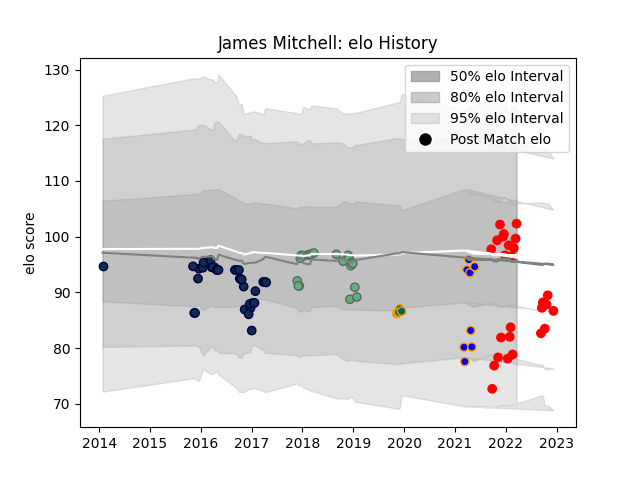

---  
layout: page  
title: James Mitchell  
date: 2023-03-21 18:39:42.582985  
categories: player  
---
# James Mitchell

Last updated: 2023-03-21
## Positions: SH

## Current elo: 102.0

## Current Percentile: 11.0

# Elo History

# Match History

| Team               |   Appearances |   Win Rate |
|:-------------------|--------------:|-----------:|
| Sale Sharks        |            34 |   0.411765 |
| Jersey             |            26 |   0.769231 |
| Connacht           |            20 |   0.55     |
| Doncaster          |             8 |   0.75     |
| Northampton Saints |             5 |   0.6      |

| Opponent            |   Matches |   Win Rate |
|:--------------------|----------:|-----------:|
| Coventry            |         4 |   1        |
| Ampthill            |         3 |   1        |
| Saracens            |         3 |   0        |
| Richmond            |         3 |   1        |
| Nottingham          |         3 |   1        |
| London Scottish     |         3 |   1        |
| Bath Rugby          |         3 |   0        |
| Hartpury College    |         3 |   1        |
| Harlequins          |         3 |   0.333333 |
| Ealing Trailfinders |         3 |   0        |
| Doncaster           |         3 |   0.333333 |
| Leicester Tigers    |         3 |   1        |
| Cornish Pirates     |         3 |   0.666667 |
| Bedford             |         3 |   0.666667 |
| Cardiff Blues       |         3 |   0.333333 |
| Dragons             |         2 |   0.5      |
| Worcester Warriors  |         2 |   1        |
| Wasps               |         2 |   0.5      |
| Ulster              |         2 |   1        |
| Toulon              |         2 |   0        |
| Scarlets            |         2 |   0.5      |
| Sale Sharks         |         2 |   0.5      |
| Benetton Treviso    |         2 |   1        |
| Perpignan           |         2 |   1        |
| Pau                 |         2 |   1        |
| Bristol Rugby       |         2 |   0        |
| Northampton Saints  |         2 |   0        |
| Newcastle Falcons   |         2 |   0.5      |
| Brive               |         2 |   1        |
| Leinster            |         2 |   0        |
| Castres Olympique   |         2 |   1        |
| Gloucester Rugby    |         2 |   0        |
| Cheetahs            |         2 |   0.5      |
| Munster             |         1 |   0        |
| Montpellier Herault |         1 |   0        |
| Lyon                |         1 |   1        |
| Ospreys             |         1 |   1        |
| Caldy               |         1 |   1        |
| Jersey              |         1 |   1        |
| Southern Kings      |         1 |   1        |
| Glasgow Warriors    |         1 |   0        |
| Exeter Chiefs       |         1 |   0        |
| Edinburgh           |         1 |   0        |
| Zebre               |         1 |   0        |