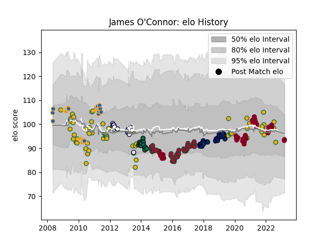

---  
layout: page  
title: James O'Connor  
date: 2023-03-17 17:13:18.023623  
categories: player  
---
# James O'Connor

## Positions: FH, FB

## Country: Australia

## Current elo: 94.0

## Current Percentile: 41.0

# Elo History

# Match History

| Team             |   Appearances |   Win Rate |
|:-----------------|--------------:|-----------:|
| Australia        |            68 |   0.507353 |
| Queensland Reds  |            52 |   0.567308 |
| Toulon           |            52 |   0.701923 |
| Western Force    |            39 |   0.371795 |
| Sale Sharks      |            30 |   0.6      |
| Melbourne Rebels |            21 |   0.190476 |
| London Irish     |            14 |   0.357143 |

| Opponent                 |   Matches |   Win Rate |
|:-------------------------|----------:|-----------:|
| New Zealand              |        17 |   0.147059 |
| Brumbies                 |        17 |   0.5      |
| New South Wales Waratahs |        15 |   0.4      |
| Melbourne Rebels         |        10 |   0.75     |
| South Africa             |        10 |   0.6      |
| Western Force            |         9 |   0.888889 |
| Queensland Reds          |         8 |   0.125    |
| Argentina                |         7 |   0.785714 |
| Wales                    |         7 |   0.714286 |
| England                  |         7 |   0.285714 |
| Chiefs                   |         6 |   0.333333 |
| Sharks                   |         6 |   0        |
| Bath Rugby               |         6 |   0.75     |
| Blues                    |         6 |   0.25     |
| Cheetahs                 |         5 |   0.4      |
| Gloucester Rugby         |         5 |   0.6      |
| Lions                    |         5 |   0.6      |
| Leicester Tigers         |         5 |   0.4      |
| Highlanders              |         5 |   0.4      |
| Bordeaux Begles          |         5 |   0.8      |
| Clermont Auvergne        |         5 |   0.4      |
| Crusaders                |         5 |   0.1      |
| Italy                    |         4 |   1        |
| Ireland                  |         4 |   0.375    |
| Lyon                     |         4 |   0.5      |
| Stade Francais Paris     |         4 |   0.5      |
| Bulls                    |         4 |   0.5      |
| Northampton Saints       |         4 |   0.5      |
| La Rochelle              |         4 |   0.625    |
| Stade Toulousain         |         4 |   0.125    |
| Racing 92                |         4 |   0.5      |
| Wasps                    |         4 |   0.75     |
| Sale Sharks              |         4 |   0.75     |
| Saracens                 |         3 |   0.666667 |
| Pau                      |         3 |   1        |
| Newcastle Falcons        |         3 |   0.666667 |
| Stormers                 |         3 |   0.333333 |
| Scarlets                 |         3 |   0.666667 |
| Worcester Warriors       |         3 |   1        |
| Montpellier Herault      |         3 |   0.333333 |
| British and Irish Lions  |         3 |   0.333333 |
| Hurricanes               |         3 |   0        |
| Harlequins               |         3 |   0.333333 |
| Exeter Chiefs            |         3 |   0        |
| France                   |         2 |   1        |
| Castres Olympique        |         2 |   1        |
| Connacht                 |         2 |   0.5      |
| Scotland                 |         2 |   0        |
| Oyonnax                  |         2 |   1        |
| Grenoble                 |         2 |   1        |
| Agen                     |         2 |   1        |
| Fijian Drua              |         1 |   1        |
| Moana Pasifika           |         1 |   1        |
| Fiji                     |         1 |   1        |
| Russia                   |         1 |   1        |
| Southern Kings           |         1 |   0        |
| Samoa                    |         1 |   1        |
| Jaguares                 |         1 |   0        |
| Brive                    |         1 |   1        |
| Sunwolves                |         1 |   1        |
| Ulster                   |         1 |   1        |
| Japan                    |         1 |   1        |
| Bristol Rugby            |         1 |   1        |
| Bayonne                  |         1 |   1        |
| Georgia                  |         1 |   1        |