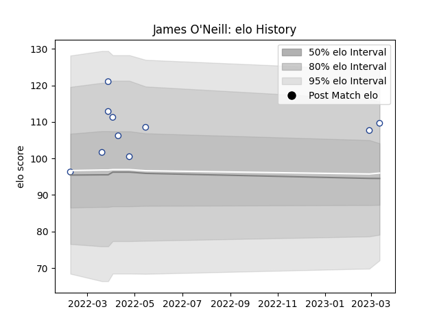

---  
layout: page  
title: James O'Neill  
date: 2023-03-02 11:27:27.181182  
categories: player  
---
# James O'Neill

## Positions: FL

## Current elo: 108.0

## Current Percentile: 81.0

# Elo History

# Match History

| Team           |   Appearances |   Win Rate |
|:---------------|--------------:|-----------:|
| Toronto Arrows |             9 |   0.555556 |

| Opponent          |   Matches |   Win Rate |
|:------------------|----------:|-----------:|
| Rugby New York    |         2 |        0.5 |
| Dallas Jackals    |         1 |        1   |
| Houston SaberCats |         1 |        0   |
| Old Glory DC      |         1 |        1   |
| R.U. New York     |         1 |        1   |
| Rugby ATL         |         1 |        0   |
| Seattle Seawolves |         1 |        0   |
| Utah Warriors     |         1 |        1   |