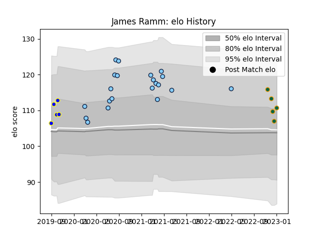

---  
layout: page  
title: James Ramm  
date: 2022-12-14 11:12:45.388565  
categories: player  
---
# James Ramm

## Positions: W

## Current elo: 103.0

## Current Percentile: 82.0

# Elo History

# Match History

| Team                     |   Appearances |   Win Rate |
|:-------------------------|--------------:|-----------:|
| New South Wales Waratahs |            21 |   0.285714 |
| Sydney Rays              |             5 |   0.2      |
| Northampton Saints       |             3 |   0        |

| Opponent           |   Matches |   Win Rate |
|:-------------------|----------:|-----------:|
| Brumbies           |         5 |       0    |
| Western Force      |         5 |       0.4  |
| Melbourne Rebels   |         4 |       0.25 |
| Queensland Reds    |         4 |       0.25 |
| Chiefs             |         2 |       0    |
| Canberra Vikings   |         1 |       0    |
| Crusaders          |         1 |       1    |
| Gloucester Rugby   |         1 |       0    |
| La Rochelle        |         1 |       0    |
| Lions              |         1 |       1    |
| Melbourne Rising   |         1 |       0    |
| NSW Country Eagles |         1 |       0    |
| Queensland Country |         1 |       1    |
| Saracens           |         1 |       0    |