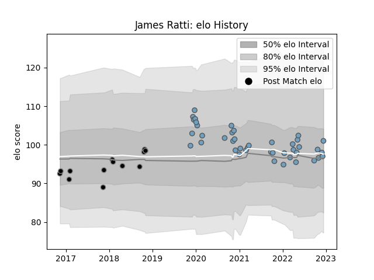

---  
layout: page  
title: James Ratti  
date: 2022-12-09 13:24:17.756025  
categories: player  
---
# James Ratti

## Positions: L, N8

## Current elo: 97.0

## Current Percentile: 51.0

# Elo History

# Match History

| Team          |   Appearances |   Win Rate |
|:--------------|--------------:|-----------:|
| Cardiff Blues |            41 |   0.439024 |
| Ospreys       |            13 |   0.384615 |

| Opponent           |   Matches |   Win Rate |
|:-------------------|----------:|-----------:|
| Ospreys            |         5 |   0.4      |
| Benetton Treviso   |         5 |   0.8      |
| Glasgow Warriors   |         4 |   0.25     |
| Munster            |         4 |   0        |
| Edinburgh          |         4 |   0.25     |
| Dragons            |         3 |   1        |
| Scarlets           |         3 |   0.333333 |
| Connacht           |         3 |   0.666667 |
| Cardiff Blues      |         2 |   1        |
| Ulster             |         2 |   0        |
| Harlequins         |         2 |   0        |
| Wasps              |         2 |   0.5      |
| Bulls              |         2 |   0        |
| Pau                |         2 |   0.5      |
| Zebre              |         2 |   0.5      |
| Sharks             |         1 |   1        |
| Stormers           |         1 |   1        |
| Worcester Warriors |         1 |   0        |
| Bath Rugby         |         1 |   0        |
| Leinster           |         1 |   0        |
| Gloucester Rugby   |         1 |   0        |
| Calvisano          |         1 |   1        |
| Bristol Rugby      |         1 |   1        |
| Leicester Tigers   |         1 |   0        |