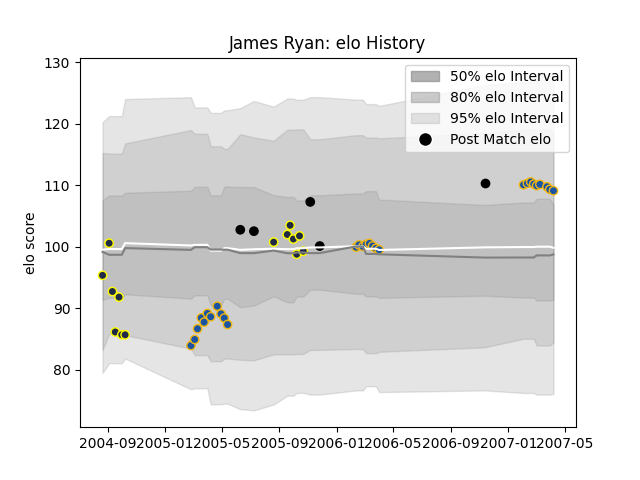

---  
layout: page  
title: James Ryan  
date: 2022-11-22 11:34:02.680458  
categories: player  
---
# James Ryan

## Positions: L

## Country: New Zealand

## Current elo: 106.0

## Current Percentile: 51.0

# Elo History

# Match History

| Team        |   Appearances |   Win Rate |
|:------------|--------------:|-----------:|
| Otago       |            11 |   0.409091 |
| New Zealand |             4 |   1        |

| Opponent      |   Matches |   Win Rate |
|:--------------|----------:|-----------:|
| Taranaki      |         2 |        0.5 |
| Waikato       |         2 |        0   |
| Auckland      |         1 |        0   |
| Bay of Plenty |         1 |        0   |
| Canterbury    |         1 |        1   |
| Fiji          |         1 |        1   |
| France        |         1 |        1   |
| North Harbour |         1 |        0   |
| Northland     |         1 |        1   |
| Scotland      |         1 |        1   |
| Southland     |         1 |        1   |
| Wales         |         1 |        1   |
| Wellington    |         1 |        0.5 |