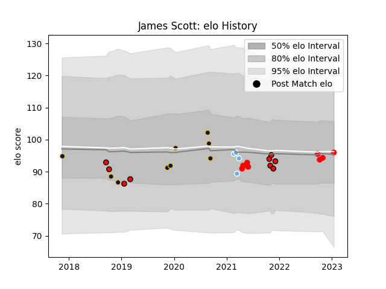

---  
layout: page  
title: James Scott  
date: 2023-01-21 15:42:53.948003  
categories: player  
---
# James Scott

## Positions: L

## Current elo: 96.0

## Current Percentile: 50.0

# Elo History

# Match History

| Team               |   Appearances |   Win Rate |
|:-------------------|--------------:|-----------:|
| Hartpury College   |             9 |   0.222222 |
| Worcester Warriors |             9 |   0.444444 |
| Jersey             |             8 |   0.8125   |
| Glasgow Warriors   |             4 |   0.75     |

| Opponent            |   Matches |   Win Rate |
|:--------------------|----------:|-----------:|
| Ealing Trailfinders |         3 |        0   |
| Hartpury College    |         2 |        1   |
| London Scottish     |         2 |        1   |
| Cornish Pirates     |         2 |        0.5 |
| Doncaster           |         2 |        0   |
| RC Enisei           |         2 |        1   |
| Ospreys             |         2 |        1   |
| Wasps               |         1 |        0   |
| Ulster              |         1 |        0   |
| Richmond            |         1 |        1   |
| Pau                 |         1 |        0   |
| Nottingham          |         1 |        1   |
| Bath Rugby          |         1 |        0   |
| Jersey              |         1 |        0   |
| Bedford             |         1 |        0   |
| Harlequins          |         1 |        0   |
| Exeter Chiefs       |         1 |        0   |
| Dragons             |         1 |        1   |
| Coventry            |         1 |        0.5 |
| Caldy               |         1 |        1   |
| Benetton Treviso    |         1 |        1   |
| Zebre               |         1 |        1   |