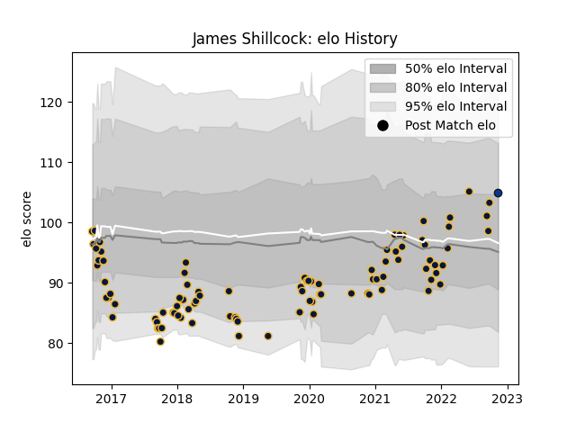

---  
layout: page  
title: James Shillcock  
date: 2023-02-02 19:00:30.195989  
categories: player  
---
# James Shillcock

## Positions: FB, FH

## Current elo: 103.0

## Current Percentile: 74.0

# Elo History

# Match History

| Team                 |   Appearances |   Win Rate |
|:---------------------|--------------:|-----------:|
| Worcester Warriors   |            94 |   0.303191 |
| Mitsubishi Dynaboars |             6 |   0.583333 |
| Bath Rugby           |             1 |   1        |

| Opponent                  |   Matches |   Win Rate |
|:--------------------------|----------:|-----------:|
| Wasps                     |         8 |   0.125    |
| Gloucester Rugby          |         7 |   0.142857 |
| Bristol Rugby             |         7 |   0.285714 |
| Leicester Tigers          |         7 |   0.142857 |
| Exeter Chiefs             |         7 |   0.285714 |
| Sale Sharks               |         6 |   0.25     |
| Newcastle Falcons         |         6 |   0.583333 |
| Harlequins                |         6 |   0.5      |
| Bath Rugby                |         6 |   0.166667 |
| London Irish              |         5 |   0.6      |
| Saracens                  |         5 |   0.2      |
| Dragons                   |         4 |   0.5      |
| RC Enisei                 |         4 |   0.75     |
| Northampton Saints        |         4 |   0        |
| Brive                     |         3 |   0.333333 |
| Ospreys                   |         2 |   0.5      |
| Oyonnax                   |         2 |   0.5      |
| Pau                       |         2 |   0        |
| Castres Olympique         |         2 |   0        |
| Black Rams Tokyo          |         1 |   1        |
| Connacht                  |         1 |   0.5      |
| Shizuoka Blue Revs        |         1 |   0.5      |
| Stade Francais Paris      |         1 |   1        |
| Tokyo Sungoliath          |         1 |   0        |
| Toshiba Brave Lupus Tokyo |         1 |   1        |
| Toyota Verblitz           |         1 |   1        |
| Saitama Wild Knights      |         1 |   0        |