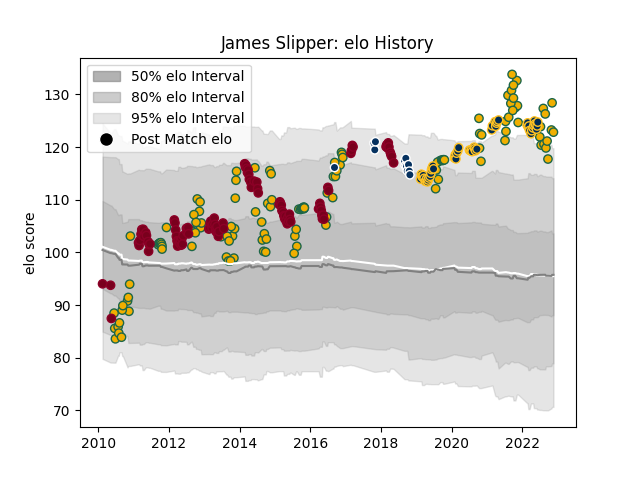

---  
layout: page  
title: James Slipper  
date: 2023-03-21 18:20:47.332251  
categories: player  
---
# James Slipper

Last updated: 2023-03-21
## Positions: P

## Country: Australia

## Current elo: 126.0

## Current Percentile: 97.0

# Elo History

# Match History

| Team               |   Appearances |   Win Rate |
|:-------------------|--------------:|-----------:|
| Australia          |           130 |   0.534615 |
| Queensland Reds    |           104 |   0.490385 |
| Brumbies           |            58 |   0.741379 |
| Queensland Country |            12 |   0.583333 |

| Opponent                 |   Matches |   Win Rate |
|:-------------------------|----------:|-----------:|
| New Zealand              |        32 |   0.171875 |
| New South Wales Waratahs |        21 |   0.619048 |
| Western Force            |        19 |   0.657895 |
| South Africa             |        18 |   0.555556 |
| England                  |        16 |   0.25     |
| Melbourne Rebels         |        16 |   0.75     |
| Argentina                |        16 |   0.875    |
| Brumbies                 |        13 |   0.423077 |
| Wales                    |        12 |   0.833333 |
| France                   |        11 |   0.636364 |
| Queensland Reds          |        10 |   0.6      |
| Chiefs                   |         9 |   0.666667 |
| Highlanders              |         8 |   0.75     |
| Crusaders                |         8 |   0.125    |
| Hurricanes               |         8 |   0.375    |
| Blues                    |         8 |   0.625    |
| Sharks                   |         7 |   0.428571 |
| Bulls                    |         7 |   0.571429 |
| Stormers                 |         7 |   0.428571 |
| Lions                    |         6 |   0.5      |
| Ireland                  |         6 |   0.333333 |
| Cheetahs                 |         5 |   0.8      |
| Fijian Drua              |         5 |   0.8      |
| Sunwolves                |         5 |   0.8      |
| Italy                    |         4 |   1        |
| Scotland                 |         4 |   0.75     |
| Jaguares                 |         3 |   0.333333 |
| Fiji                     |         3 |   1        |
| United States of America |         2 |   1        |
| Moana Pasifika           |         2 |   0.5      |
| British and Irish Lions  |         2 |   0.5      |
| Melbourne Rising         |         2 |   0.5      |
| Russia                   |         1 |   1        |
| Samoa                    |         1 |   1        |
| Perth Spirit             |         1 |   0        |
| Brisbane City            |         1 |   0        |
| NSW Country Eagles       |         1 |   1        |
| Georgia                  |         1 |   1        |
| Uruguay                  |         1 |   1        |
| Canberra Vikings         |         1 |   1        |
| Japan                    |         1 |   1        |