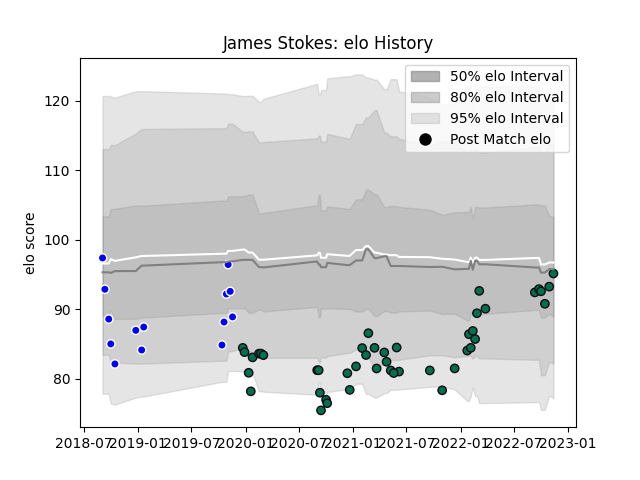

---  
layout: page  
title: James Stokes  
date: 2023-03-17 17:02:01.979687  
categories: player  
---
# James Stokes

## Positions: FB, W

## Current elo: 100.0

## Current Percentile: 64.0

# Elo History

# Match History

| Team         |   Appearances |   Win Rate |
|:-------------|--------------:|-----------:|
| London Irish |            54 |   0.425926 |
| Coventry     |            14 |   0.5      |

| Opponent            |   Matches |   Win Rate |
|:--------------------|----------:|-----------:|
| Worcester Warriors  |         6 |   0.5      |
| Harlequins          |         6 |   0.416667 |
| Bristol Rugby       |         6 |   0.416667 |
| Gloucester Rugby    |         5 |   0.2      |
| Exeter Chiefs       |         5 |   0.4      |
| Newcastle Falcons   |         5 |   0.6      |
| Sale Sharks         |         4 |   0.375    |
| Northampton Saints  |         3 |   0.333333 |
| Saracens            |         3 |   0.333333 |
| Bath Rugby          |         3 |   0.666667 |
| Doncaster           |         2 |   0.5      |
| Cornish Pirates     |         2 |   0.5      |
| Wasps               |         2 |   0        |
| Jersey              |         2 |   0.5      |
| Pau                 |         2 |   1        |
| Scarlets            |         1 |   0        |
| Nottingham          |         1 |   0.5      |
| Agen                |         1 |   1        |
| Leicester Tigers    |         1 |   0        |
| Montpellier Herault |         1 |   0.5      |
| London Scottish     |         1 |   1        |
| London Irish        |         1 |   0        |
| Hartpury College    |         1 |   0        |
| Ealing Trailfinders |         1 |   0.5      |
| Bedford             |         1 |   1        |
| Bayonne             |         1 |   0        |
| Yorkshire Carnegie  |         1 |   1        |