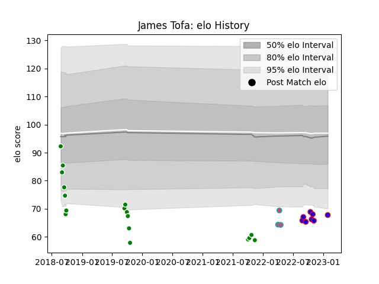

---  
layout: page  
title: James Tofa  
date: 2023-02-02 19:13:20.602969  
categories: player  
---
# James Tofa

## Positions: C, W

## Current elo: 68.0

## Current Percentile: 2.0

# Elo History

# Match History

| Team             |   Appearances |   Win Rate |
|:-----------------|--------------:|-----------:|
| Manawatu         |            17 |   0.352941 |
| Beziers          |             8 |   0.5      |
| Bourgoin-Jallieu |             3 |   0.666667 |

| Opponent                   |   Matches |   Win Rate |
|:---------------------------|----------:|-----------:|
| Otago                      |         3 |   0.333333 |
| Bay of Plenty              |         3 |   0.333333 |
| Canterbury                 |         2 |   0.5      |
| Taranaki                   |         2 |   0        |
| Southland                  |         2 |   1        |
| Provence Rugby             |         2 |   0.5      |
| Aurillac                   |         1 |   0        |
| Northland                  |         1 |   0        |
| Valence Romans Drome Rugby |         1 |   0        |
| Tasman                     |         1 |   0        |
| Oyonnax                    |         1 |   0        |
| North Harbour              |         1 |   0        |
| Montauban                  |         1 |   1        |
| Mont-de-Marsan             |         1 |   1        |
| Massy                      |         1 |   1        |
| Grenoble                   |         1 |   0        |
| Dijon                      |         1 |   1        |
| Counties Manukau           |         1 |   1        |
| Blagnac                    |         1 |   1        |
| Wellington                 |         1 |   0        |