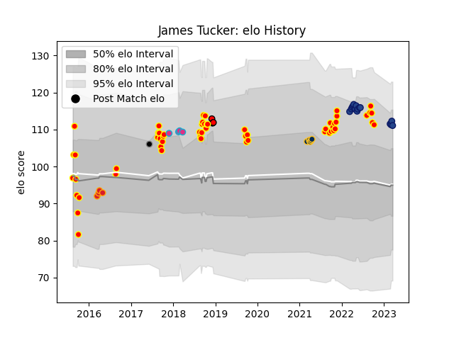

---  
layout: page  
title: James Tucker  
date: 2023-03-02 11:21:52.111936  
categories: player  
---
# James Tucker

## Positions: L, FL

## Country: Provincial Union XV

## Current elo: 111.0

## Current Percentile: 87.0

# Elo History

# Match History

| Team                      |   Appearances |   Win Rate |
|:--------------------------|--------------:|-----------:|
| Waikato                   |            56 |   0.473214 |
| Blues                     |            13 |   1        |
| Brumbies                  |             5 |   0.8      |
| Chiefs                    |             4 |   1        |
| Zebre                     |             4 |   0.25     |
| Toshiba Brave Lupus Tokyo |             3 |   0.666667 |
| Provincial Union XV       |             1 |   0        |

| Opponent                 |   Matches |   Win Rate |
|:-------------------------|----------:|-----------:|
| Tasman                   |         7 |   0.428571 |
| Wellington               |         6 |   0.333333 |
| Taranaki                 |         6 |   0.5      |
| Hawke's Bay              |         5 |   0.5      |
| Otago                    |         5 |   0.4      |
| Bay of Plenty            |         5 |   0.6      |
| Auckland                 |         4 |   0.5      |
| Northland                |         4 |   0.5      |
| North Harbour            |         4 |   0.5      |
| Highlanders              |         4 |   1        |
| Western Force            |         3 |   1        |
| Melbourne Rebels         |         3 |   1        |
| Manawatu                 |         3 |   0.333333 |
| Brumbies                 |         3 |   1        |
| Canterbury               |         3 |   0.333333 |
| Queensland Reds          |         2 |   0.5      |
| Southland                |         2 |   1        |
| Counties Manukau         |         2 |   0.5      |
| Green Rockets Tokatsu    |         1 |   0        |
| British and Irish Lions  |         1 |   0        |
| Cardiff Blues            |         1 |   0        |
| Southern Kings           |         1 |   1        |
| Sharks                   |         1 |   1        |
| Chiefs                   |         1 |   1        |
| Glasgow Warriors         |         1 |   0        |
| Connacht                 |         1 |   1        |
| New South Wales Waratahs |         1 |   1        |
| Munster                  |         1 |   0        |
| Moana Pasifika           |         1 |   1        |
| Crusaders                |         1 |   1        |
| Fijian Drua              |         1 |   1        |
| Hino Red Dolphins        |         1 |   1        |
| Yokohama Canon Eagles    |         1 |   1        |