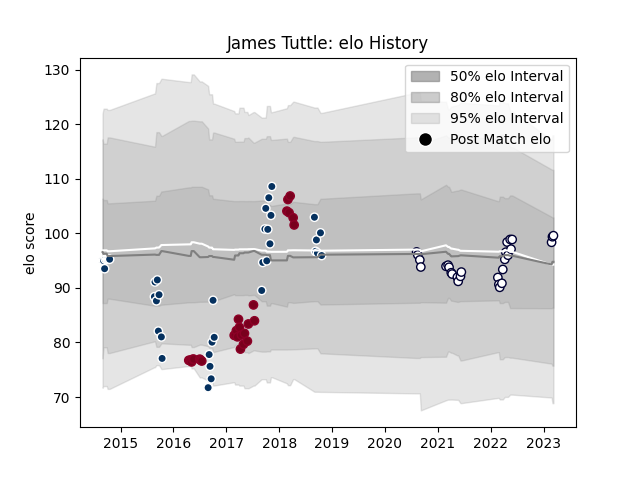

---  
layout: page  
title: James Tuttle  
date: 2023-03-02 11:25:47.486858  
categories: player  
---
# James Tuttle

## Positions: SH

## Current elo: 98.0

## Current Percentile: 62.0

# Elo History

# Match History

| Team               |   Appearances |   Win Rate |
|:-------------------|--------------:|-----------:|
| Queensland Country |            39 |   0.461538 |
| Queensland Reds    |            29 |   0.275862 |
| Melbourne Rebels   |            26 |   0.307692 |

| Opponent                 |   Matches |   Win Rate |
|:-------------------------|----------:|-----------:|
| Western Force            |        10 |   0.4      |
| Brumbies                 |         6 |   0.5      |
| Canberra Vikings         |         6 |   0.333333 |
| Melbourne Rising         |         5 |   0.4      |
| Queensland Reds          |         5 |   0        |
| New South Wales Waratahs |         5 |   0.2      |
| NSW Country Eagles       |         5 |   0.8      |
| Chiefs                   |         4 |   0        |
| Crusaders                |         4 |   0        |
| Perth Spirit             |         4 |   0        |
| Fijian Drua              |         4 |   0.75     |
| Greater Sydney Rams      |         4 |   0.75     |
| Hurricanes               |         4 |   0        |
| Brisbane City            |         4 |   0.25     |
| North Harbour Rays       |         3 |   0        |
| Sydney Stars             |         2 |   0.5      |
| Blues                    |         2 |   0        |
| Jaguares                 |         2 |   0.5      |
| Highlanders              |         2 |   0.5      |
| Bulls                    |         2 |   0.5      |
| Melbourne Rebels         |         2 |   0        |
| Moana Pasifika           |         1 |   1        |
| Lions                    |         1 |   0        |
| Fiji                     |         1 |   1        |
| Cheetahs                 |         1 |   1        |
| Sharks                   |         1 |   1        |
| Southern Kings           |         1 |   1        |
| Stormers                 |         1 |   0        |
| Sunwolves                |         1 |   1        |
| Sydney Rays              |         1 |   1        |