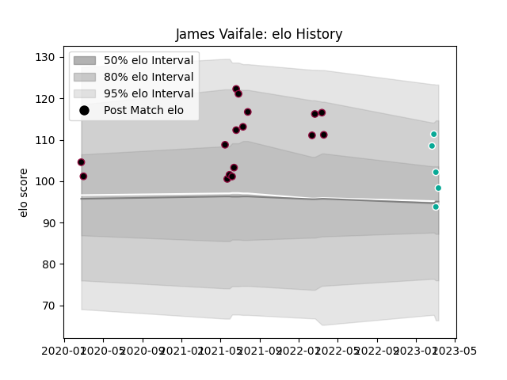

---  
layout: page  
title: James Vaifale  
date: 2023-03-17 17:16:27.245260  
categories: player  
---
# James Vaifale

## Positions: W

## Current elo: 98.0

## Current Percentile: 71.0

# Elo History

# Match History

| Team           |   Appearances |   Win Rate |
|:---------------|--------------:|-----------:|
| Utah Warriors  |            16 |    0.46875 |
| Dallas Jackals |             5 |    0       |

| Opponent          |   Matches |   Win Rate |
|:------------------|----------:|-----------:|
| Seattle Seawolves |         4 |   0.25     |
| L. A. Giltinis    |         3 |   0.333333 |
| Austin Gilgronis  |         2 |   0.5      |
| Houston SaberCats |         2 |   0.5      |
| San Diego Legion  |         2 |   0.5      |
| Austin Herd       |         1 |   0.5      |
| Colorado Raptors  |         1 |   0        |
| NOLA Gold         |         1 |   0        |
| R.U. New York     |         1 |   1        |
| Rugby ATL         |         1 |   0        |
| Rugby New York    |         1 |   1        |
| Toronto Arrows    |         1 |   0        |
| Utah Warriors     |         1 |   0        |