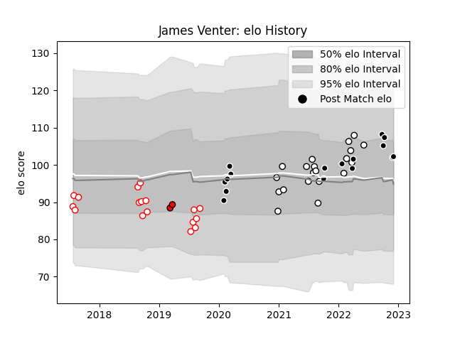

---  
layout: page  
title: James Venter  
date: 2023-03-21 18:53:49.731166  
categories: player  
---
# James Venter

Last updated: 2023-03-21
## Positions: FL

## Current elo: 102.0

## Current Percentile: 65.0

# Elo History

# Match History

| Team         |   Appearances |   Win Rate |
|:-------------|--------------:|-----------:|
| Natal Sharks |            20 |   0.55     |
| Golden Lions |            17 |   0.470588 |
| Sharks       |            16 |   0.6875   |
| Lions        |             2 |   1        |

| Opponent            |   Matches |   Win Rate |
|:--------------------|----------:|-----------:|
| Free State Cheetahs |         8 |   0.5      |
| Griquas             |         7 |   0.857143 |
| Blue Bulls          |         6 |   0.333333 |
| Western Province    |         6 |   0.5      |
| Pumas               |         4 |   0.75     |
| Natal Sharks        |         3 |   0        |
| Golden Lions        |         3 |   0.333333 |
| Ospreys             |         2 |   1        |
| Jaguares            |         2 |   1        |
| Dragons             |         2 |   1        |
| Highlanders         |         1 |   1        |
| Hurricanes          |         1 |   0        |
| Bulls               |         1 |   1        |
| Leinster            |         1 |   0        |
| Lions               |         1 |   1        |
| Melbourne Rebels    |         1 |   1        |
| Glasgow Warriors    |         1 |   0        |
| Edinburgh           |         1 |   0        |
| Stormers            |         1 |   1        |
| Sunwolves           |         1 |   1        |
| Cardiff Blues       |         1 |   0        |
| Zebre               |         1 |   1        |