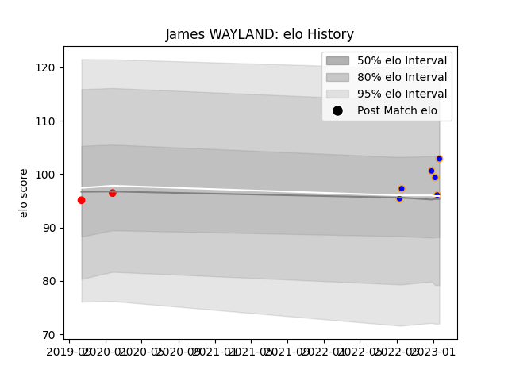

---  
layout: page  
title: James WAYLAND  
date: 2023-01-27 19:02:08.354821  
categories: player  
---
# James WAYLAND

## Positions: P

## Current elo: 103.0

## Current Percentile: None

# Elo History

# Match History

| Team      |   Appearances |   Win Rate |
|:----------|--------------:|-----------:|
| Doncaster |             6 |        0.5 |
| Jersey    |             2 |        1   |

| Opponent            |   Matches |   Win Rate |
|:--------------------|----------:|-----------:|
| Hartpury College    |         2 |        0.5 |
| Caldy               |         1 |        1   |
| Cornish Pirates     |         1 |        0   |
| Coventry            |         1 |        1   |
| Ealing Trailfinders |         1 |        0   |
| Richmond            |         1 |        1   |
| Yorkshire Carnegie  |         1 |        1   |