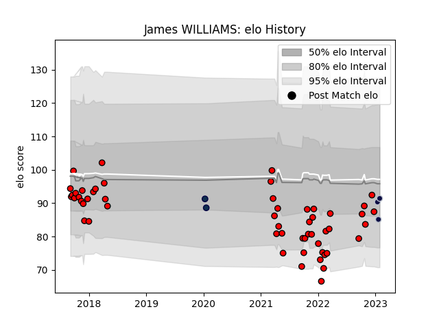

---  
layout: page  
title: James WILLIAMS  
date: 2023-03-02 11:20:54.051240  
categories: player  
---
# James WILLIAMS

## Positions: FH, C

## Current elo: 78.0

## Current Percentile: 17.0

# Elo History

# Match History

| Team             |   Appearances |   Win Rate |
|:-----------------|--------------:|-----------:|
| Hartpury College |            54 |   0.333333 |
| Bristol Rugby    |             5 |   0.8      |
| Sale Sharks      |             2 |   0        |

| Opponent            |   Matches |   Win Rate |
|:--------------------|----------:|-----------:|
| Bedford             |         6 |   0.166667 |
| Jersey              |         6 |   0        |
| Nottingham          |         6 |   0.666667 |
| Richmond            |         5 |   0.4      |
| Cornish Pirates     |         5 |   0.4      |
| Doncaster           |         5 |   0.2      |
| Ealing Trailfinders |         5 |   0        |
| Coventry            |         4 |   0.5      |
| Ampthill            |         3 |   0.333333 |
| London Scottish     |         3 |   0.833333 |
| Bristol Rugby       |         2 |   0        |
| Yorkshire Carnegie  |         2 |   0.25     |
| Rotherham Titans    |         2 |   1        |
| Saracens            |         1 |   0        |
| La Rochelle         |         1 |   0        |
| Perpignan           |         1 |   1        |
| Newcastle Falcons   |         1 |   1        |
| Bath Rugby          |         1 |   1        |
| Glasgow Warriors    |         1 |   0        |
| Zebre               |         1 |   1        |